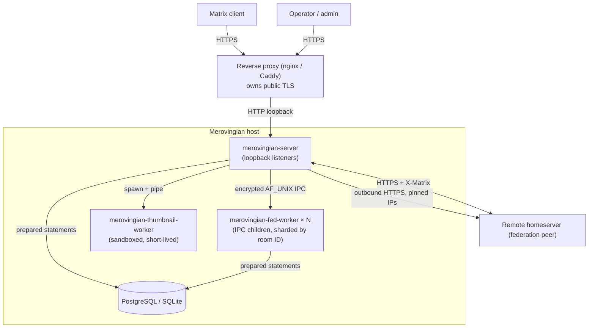
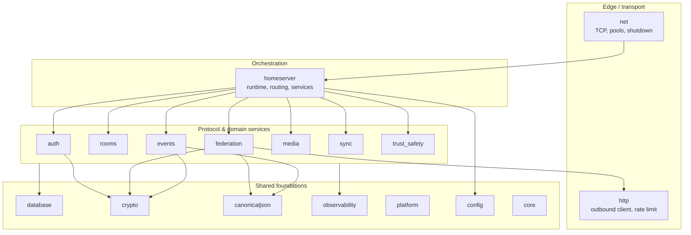
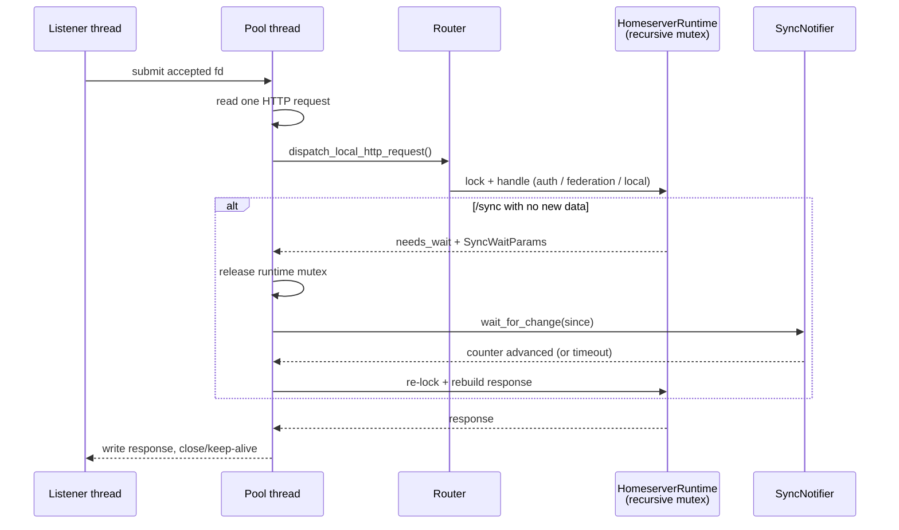
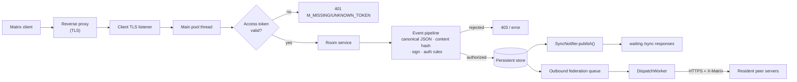
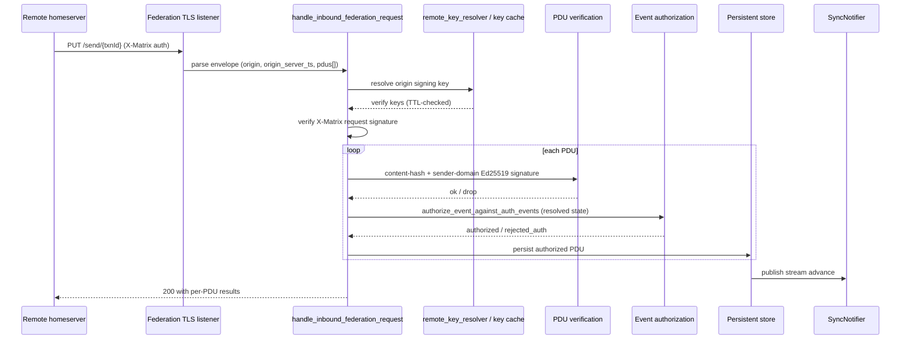
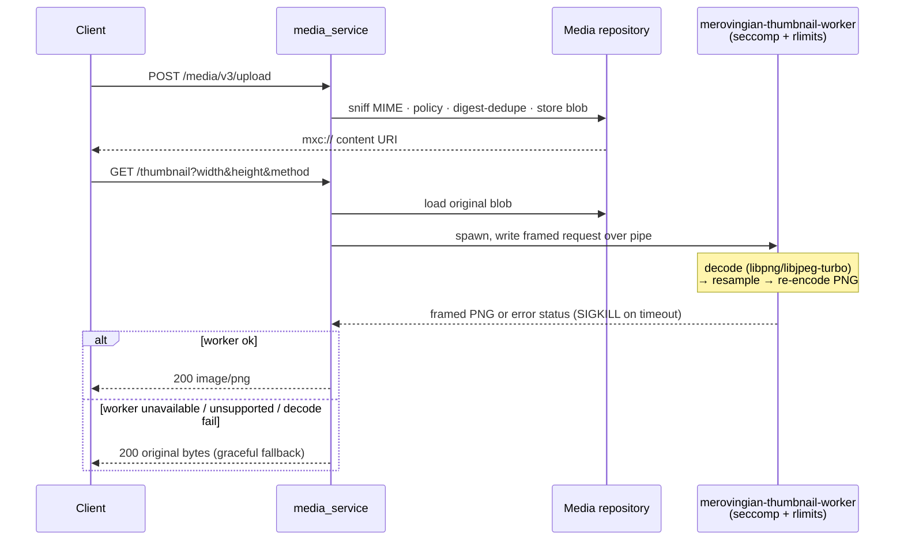

# Architecture

## Design priorities

1. Security first.
2. Correctness before features.
3. Hardened defaults.
4. Bounded resource usage.
5. Auditability.
6. Scale without bypassing checks.

## System context

Merovingian is designed to run behind a reverse proxy (which owns public TLS),
bound to loopback listeners. It talks to a SQL backend, isolates untrusted image
decoding in a sandboxed helper process, and federates with remote homeservers
over authenticated HTTPS.



Trust boundaries are explicit: every arrow crossing into `merovingian-server`
from `client`, `remote`, or `admin` carries untrusted input and is authenticated
and validated before it reaches state. See [threat-model.md](threat-model.md).

## Source tree

Seventeen modules under `src/` and `include/merovingian/`, each compiling into a static library linked into the server and test binaries:

| Module | Purpose |
|--------|---------|
| `auth` | Sessions, tokens, key API |
| `canonicaljson` | Matrix canonical JSON parser, serializer, signing |
| `config` | Configuration parsing, validation, reload |
| `core` | Utilities: file_descriptor, query_params, secret_buffer, not_null |
| `crypto` | Ed25519 signing/verification, constant-time comparison, secure random |
| `database` | Persistence layer: PostgreSQL, SQLite, schema, migrations |
| `events` | Event parsing, authorization rules, redaction, state resolution |
| `federation` | Inbound/outbound federation, transactions, discovery |
| `homeserver` | Top-level runtime, HTTP serving, routing, auth/room/media services |
| `http` | Outbound HTTP client (libcurl), rate limiting |
| `ipc` | Encrypted AF_UNIX IPC channel (ephemeral key exchange, AEAD framing) |
| `media` | Media repository: upload, download, quarantine |
| `net` | TCP listener, thread pool, shutdown signal |
| `observability` | Logging, health checks, structured diagnostics |
| `platform` | POSIX file metadata, hardening self-checks |
| `rooms` | Room version policy, encryption policy |
| `sync` | Sync notifier, stream tokens, sync filters |
| `trust_safety` | Policy engine for moderation rules |

Entry points: `src/main.cpp` (server), `src/db_migrate.cpp` (standalone migration tool), and `src/federation_worker/main.cpp` (out-of-process federation worker).

### Module layering

Modules form a layered dependency graph. Edge transport and routing sit at the
top; protocol/domain services in the middle; shared foundations at the bottom.
Dependencies point downward — foundations never depend on services.



All foundation modules depend on `core` (RAII utilities, `not_null`,
`secret_buffer`); it is the leaf of the graph.

## Runtime model

```text
merovingian-server
  ├── main pool (8 threads) — all non-sync requests
  ├── sync pool  (32 threads) — /sync long-polls only
  ├── client listener thread — plain TCP accept loop
  ├── client TLS listener thread — OpenSSL accept loop
  ├── federation listener thread — plain TCP accept loop
  ├── federation TLS listener thread — OpenSSL accept loop
  ├── DispatchWorker thread — outbound federation queue
  ├── WorkerPool — manages N WorkerSupervisor threads, one per federation shard
  └── observability pipeline

merovingian-fed-worker × N  [spawned when federation.worker.enabled=true]
  Each worker owns a subset of room IDs by FNV-1a hash of the room ID.
  ├── IPC reader thread — receives fed_request / pdu_ingest_result frames
  └── worker thread pool (threads = federation.worker.threads) — handles fed_request concurrently
```

`start_client_server(config)` returns a `ClientServerRuntime` holding `HomeserverRuntime`, which owns the persistent store, federation state, media, outbound client, discovery network, sync notifier, and a recursive mutex serialising access to the runtime.

Request flow:

1. Listener thread accepts a connection, submits the fd to the pool.
2. Pool thread reads one HTTP request, routes it via `dispatch_local_http_request()`.
3. Authenticated client-server requests go to `handle_client_server_request()`.
4. Federation requests go to `FederationProxy::handle()` (when `federation.worker.enabled=true`) which verifies the inbound X-Matrix signature itself (`verify_inbound_federation_signature`), then extracts the room ID, selects the owning worker shard (`fnv1a_32(room_id) % federation.worker.shards`), and serialises only the verified identity (`origin`/`key_id`/`sig_verified`) over the authenticated, encrypted IPC channel to that `merovingian-fed-worker` process; the raw peer `Authorization` header never crosses IPC (#323). Non-room requests route to shard 0. When the worker is disabled, requests go directly to `handle_federation_http_request()`, which performs verification in-process.
5. In-process requests (room creation that needs both auth and federation) go through `handle_local_http_request()`.
6. For `/sync` long-polls: if no new data exists, `DispatchResult::needs_wait` is returned with `SyncWaitParams`. The HTTP server releases the runtime mutex, calls `SyncNotifier::wait_for_change()`, then re-acquires the lock and rebuilds the response. This offloading keeps the main pool free for real requests.



Shutdown uses the self-pipe trick: SIGINT/SIGTERM writes to a pipe watched by `poll(2)`. Both pools drain and join, listener threads are joined, and the process exits.

## Data flow

Data crosses three trust boundaries: the client edge, the federation edge, and
the media-decode boundary. Untrusted bytes are authenticated, parsed with
bounded parsers, and validated against Matrix rules **before** they reach the
persistent store, and only validated events wake the sync notifier.

### Local event write path

A client sending a room event flows through authentication, the event pipeline
(canonical JSON → content hash → Ed25519 signing → authorization rules), and
persistence. Persisting an event publishes a sync-stream advance and queues
outbound federation delivery to resident peers.



### Inbound federation PDU path

An inbound `PUT /send/{txnId}` transaction is authenticated at the transport
(X-Matrix), then each PDU is independently verified and authorized. Per the
Matrix spec, individual PDU failures are reported inside the response body — the
transaction still returns 200 so the peer does not back off all federation.



### Media upload and thumbnail path

Uploaded bytes are MIME-sniffed, policy-checked, deduplicated by content digest,
and stored. Thumbnails are generated **on demand** by spawning the sandboxed
worker; the server process never decodes untrusted image bytes itself.



## Data types

**Config** (`config/config.hpp`): Aggregate of `ServerConfig`, `ListenersConfig`, `DatabaseConfig`, `SecurityConfig`. `DatabaseBackend` enum (`postgresql`, `sqlite`). `SecurityConfig` holds registration, encryption, federation, media, and logging sub-configs.

**JSON** (`canonicaljson/value.hpp`): `Value` is a variant of `nullptr_t`, `bool`, `int64_t`, `string`, `Array`, `Object`. `ObjectMember` holds a key and owned `Value`. `Parser` and `Serializer` handle round-tripping. `Signable` builds Matrix canonical JSON signing payloads.

**Events** (`events/event.hpp`): `EventEnvelope` carries parsed `room_id`, `event_type`, `sender`, `state_key`, `signatures`, and raw JSON. `EventSignature` is `{server_name, key_id, signature}`.

**Crypto** (`crypto/ed25519.hpp`, `signing_service.hpp`): `Ed25519Provider` (virtual) for `sign()`/`verify()`. `SigningKeyStore` (virtual) for key lookup by server name. `RuntimeSigningKeyStore` wires production key resolution through the persistent store. Libsodium provides Ed25519 signing, constant-time comparison, and secure random.

**Core utilities**: `core::not_null<T>` null-checked pointer wrapper. `core::secret_buffer` zeroes memory on destruction. `core::file_descriptor` RAII POSIX fd wrapper. `core::query_params` URL query string parser.

## Database layer

Three backends via `PersistentStoreBackend` enum: `memory` (bootstrap), `postgresql` (libpq), `sqlite` (SQLite3).

`PersistentStore` (`database/persistent_store.hpp`) is the central struct holding all in-memory data mirrors plus schema state and prepared statements. It contains vectors for: users, devices, access tokens, refresh tokens, signing keys, federation destinations/transactions, rooms, memberships, invites, events, state events, event edges/auth/signatures, device keys, OTKs, fallback keys, cross-signing keys, key backup versions/sessions, local/remote media, media blobs, audit log, policy rules, account data, to-device messages, device list changes, presence, filters, profiles, room aliases.

`DatabaseExecutor` (virtual) and `PostgresqlConnection` (concrete) handle query execution with `PreparedStatement` (named, parameterised, with `sensitive` flags for audit redaction). `SchemaState`, `MigrationStep`, and `MigrationPlan` manage schema versioning.

## Federation

**Inbound** (`federation/inbound_request.hpp`, `inbound_ingestion.hpp`): `FederationRuntimeState` holds config, remote caches, accepted transactions, and injected function hooks: `remote_key_resolver`, `pdu_sink`, `edu_sink`, `state_conflict_resolver`, `membership_template_provider`, `membership_acceptor`, `invite_handler`, `backfill_provider`, `profile_query_provider`, E2EE key hooks, event-graph query hooks. `handle_inbound_federation_request()` parses X-Matrix auth, verifies signatures, and dispatches to endpoint handlers. `PUT /_matrix/federation/v1/send/{txnId}` is strict about the Matrix transaction envelope: `origin`, `origin_server_ts`, and a `pdus` array are required, `edus` is optional but must be an array when present, empty `pdus: []` remains valid, and individual PDU failures are returned inside the `pdus` response object rather than as a non-200 transaction status.

Implemented endpoints: `PUT /send/{txnId}`, `GET/PUT /make_join`, `GET/PUT /make_leave`, `GET/PUT /make_knock`, `PUT /send_join` (v1/v2), `PUT /send_leave` (v1/v2), `PUT /send_knock` (v2), `PUT /invite` (v1/v2), `GET /event/{eventId}`, `GET /state/{roomId}`, `GET /state_ids/{roomId}`, `GET /backfill/{roomId}`, `GET /query/profile`, E2EE device keys/OTK/claim/device-list routes, `GET /_matrix/key/v2/server`. Backfill decodes URI path/query Matrix IDs before dispatch and walks stored `prev_events` from each requested event to return the requested PDU plus predecessors up to the request limit.

**Outbound** (`federation/outbound_transaction.hpp`, `dispatch_worker.hpp`): `OutboundTransaction` queued with retry state. `OutboundCall` composes resolved host/port, pinned addresses (SSRF defence), and signing identity. `DispatchWorker` drains a `std::deque<OutboundTransaction>` queue with per-destination circuit breaker and exponential backoff.

**Discovery** (`federation/server_discovery.hpp`): `ServerDiscoveryNetwork` (virtual) for `.well-known`, SRV, and direct resolution. `discover_server()` chains `.well-known` → SRV → direct with SSRF protection. `FederationDestination` tracks per-destination retry state.

**Security**: `federation_discovery_policy()` rejects private/loopback IPs. `verify_federation_request_signature()` checks Ed25519 signatures. `remote_trust_policy()` applies circuit breakers. The inbound verify/handle path is split so the main process and the worker share it: `verify_inbound_federation_signature()` (main, before IPC dispatch) and `handle_inbound_federation_request()` (worker, after IPC) both call the shared `resolve_inbound_remote` (route match, TLS origin check, server/trust policy, remote-key resolution) and `check_inbound_request_signature` (Ed25519 verify) helpers. When the worker receives a `signature_verified` request from main, it skips re-verification and trusts the forwarded `origin`/`key_id` (#323).

## Client-server API

Implemented endpoints:

- **Unauthenticated**: `GET /versions`
- **Registration & auth**: `POST /register`, `POST /login`, `POST /logout`, `POST /logout/all`, `POST /refresh`, `POST /account/password`
- **Devices**: `GET/PUT/DELETE /devices/{deviceId}`, `GET /devices`
- **Rooms**: `POST /createRoom`, `POST /join/{roomIdOrAlias}`, `POST /rooms/{roomId}/join`, `POST /rooms/{roomId}/leave`, `POST /rooms/{roomId}/forget`, `PUT /rooms/{roomId}/send`, `GET /rooms/{roomId}/state`, `GET /rooms/{roomId}/members`, `PUT /rooms/{roomId}/typing/{userId}`, `PUT /rooms/{roomId}/receipt/{receiptType}/{eventId}`
- **Sync**: `GET /sync` (long-polling with `needs_wait` offload)
- **E2EE keys**: `POST /keys/query`, `POST /keys/claim`, `GET /keys/devices/{userId}`, `PUT /keys/upload`, key backup upload/version/sessions
- **Presence**: `GET/PUT /presence/{userId}/status`
- **Profile**: `GET /profile/{userId}`, `PUT /profile/{userId}/displayname`, `PUT /profile/{userId}/avatar_url`
- **Account data**: `PUT /user/{userId}/account_data/{type}`, `PUT /user/{userId}/rooms/{roomId}/account_data/{type}`
- **Filters**: `POST /user/{userId}/filter`, `GET /user/{userId}/filter/{filterId}`
- **Directory**: `GET /publicRooms`, `PUT /directory/room/{alias}`, `GET /joined_rooms`
- **Media**: `POST /media/v3/upload`, `GET /media/v3/download/{server}/{mediaId}`, `GET /media/v3/config`
- **Admin**: `GET /admin/safety/reports`, quarantine/release/remove media
- **Other**: `GET /capabilities`, `GET /voip/turnServer`, `GET /pushrules/...`, MSC2965 OIDC discovery

## Sync subsystem

**StreamToken** (`sync/stream_token.hpp`): Triple `{event_ordering, membership_ordering, sync_stream_id}` encoded as hex string. `event_ordering` and `membership_ordering` reference the last-published stream position (not the next available slot). `sync_stream_id` covers to_device, device_lists, presence, and account_data surfaces.

**SyncNotifier** (`sync/sync_notifier.hpp`): Long-polling primitive using `std::mutex` + `std::condition_variable`. Tracks `stream_ordering_` (timeline events) and `sync_stream_id_` (sync surfaces). `publish()` wakes all waiters. `wait_for_change()` blocks until either counter advances past the client's `since` values.

**Sync flow**: Client sends `GET /sync?since=...&timeout=...`. Handler acquires the runtime mutex, builds the response. If no new data since the token, returns `DispatchResult::needs_wait` with `SyncWaitParams`. The HTTP layer releases the mutex, waits on the notifier, re-acquires the lock, and rebuilds the response. Sync waits are offloaded to the dedicated 32-thread `sync_pool`.

## Build system

Meson (`>=1.1.0`), C++26, `-Werror`, warning level 3. Hardening: stack protector, PIE, hidden visibility, zero-init, stack clash protection, CF protection, FORTIFY_SOURCE=3, no-exec stack. Link flags: `-Wl,-z,noexecstack`.

Dependencies: libsodium, OpenSSL, libpq (+ pgcommon/pgport), libcurl, resolv (optional) — all **system-provided** (`allow_fallback: false`). SQLite3, yyjson, and Catch2 (tests) build from source-pinned subproject wraps when no system copy is present. The thumbnail worker links system `libpng` and `libjpeg-turbo`; when those codecs are absent the worker is not built and thumbnailing falls back to original bytes. See [platform-support.md](platform-support.md) for the per-platform system-dependency package names.

Install targets: `merovingian-server`, `merovingian-db-migrate`, `merovingian-fed-worker`, and (when image codecs are present) `merovingian-thumbnail-worker` under `libexecdir/merovingian`. Sysconfdir baked in as `MEROVINGIAN_SYSCONFDIR`; the thumbnail worker path as `MEROVINGIAN_THUMBNAIL_WORKER_PATH`; the federation worker libexec directory as `MEROVINGIAN_LIBEXECDIR`. The thumbnail worker is an out-of-process, seccomp/rlimit-sandboxed image decoder so untrusted PNG/JPEG bytes are never parsed in the server process. `merovingian-fed-worker` is an out-of-process federation handler that isolates inbound federation CPU and I/O from the client-server thread pool.

## Testing

Catch2 (v3, BDD-style `SCENARIO/GIVEN/WHEN/THEN`). Unit tests in `tests/unit/`, integration tests in `tests/integration/`. Live Synapse federation tests behind `build_live_tests` option. Fuzz tests behind `build_fuzz` option. Smoke tests in `tests/smoke/`. Tooling tests in `tests/tooling/`. Complement-style JSON fixtures in `tests/fixtures/complement/`.

Tests use in-process `ClientServerRuntime` — no real HTTP server. Requests are simulated via `handle_client_server_request(runtime, {method, target, access_token, body})`. Long-poll tests use `std::thread` producers that publish through the `SyncNotifier`.

## Security

### Trust boundaries

Four boundaries separate untrusted input from server state. Each has a mandatory
gate that runs before any state mutation:

| Boundary | Untrusted source | Gate enforced before state |
|---|---|---|
| Client edge | Matrix clients | Access-token authentication, rate limiting, bounded request parsing |
| Federation edge | Remote homeservers | X-Matrix request-signature verification, per-PDU content-hash + Ed25519 verification, event authorization rules |
| IPC channel | `merovingian-fed-worker` | Master-key-authenticated `crypto_kx` handshake (#318), AEAD-encrypted frames; main verifies inbound X-Matrix signatures and forwards only the verified peer identity (`origin`/`key_id`/`sig_verified`) — the raw peer `access_token` and `Authorization`/`X-Matrix` headers never cross the boundary (#323); the Ed25519 signing secret never crosses the boundary (#317) |
| Media decode | Uploaded/fetched image bytes | Out-of-process sandboxed worker (seccomp + rlimits); the server never decodes image bytes in-process |
| Persistence | All write paths | Prepared statements only; runtime/migration role separation |

The full attacker model, surface inventory, and per-threat mitigations live in
[threat-model.md](threat-model.md).

### Principles and controls

- All external input is hostile.
- Every queue is bounded.
- Every parser is fuzzed.
- References preferred over pointers.
- RAII required.
- No custom crypto.
- Encryption enabled by default where Matrix semantics allow.
- Config file permissions enforced (no group/other write/execute).
- SSRF defence: outbound HTTP client pins resolved addresses; federation security policy rejects private/loopback IPs.
- X-Matrix auth: full Ed25519 signature verification; expired keys rejected.
- TLS mandatory for federation outbound.
- `secret_buffer` zeroes memory on destruction.
- `constant_time::equal()` for token comparison.
- Rate limiting with configurable bucket/window.
- Audit logging across auth, federation, and media boundaries.
- Trust & safety policy engine for moderation rules.
- Media security: MIME sniffing, quarantine, AV scanner flag, sandboxed decoding flag, private IP fetch blocking.
