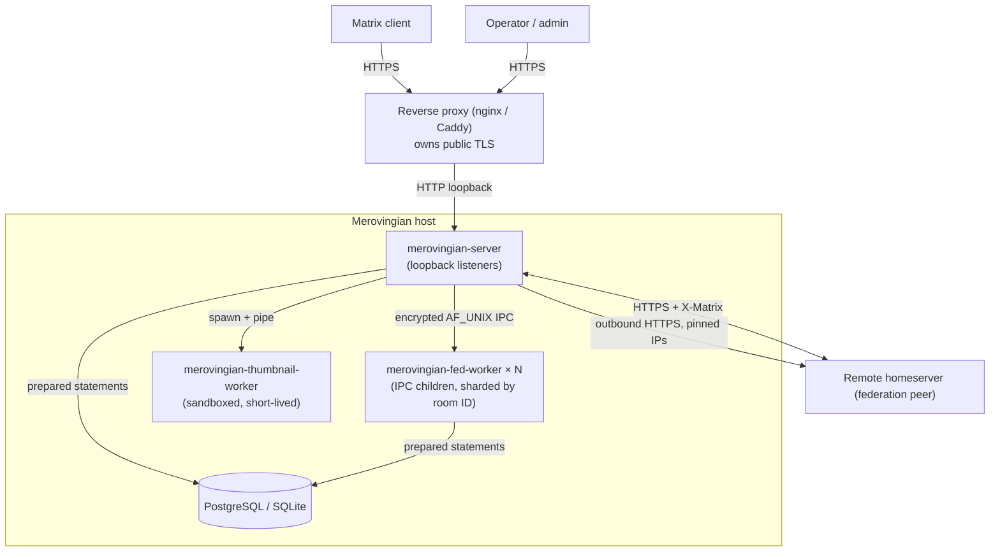
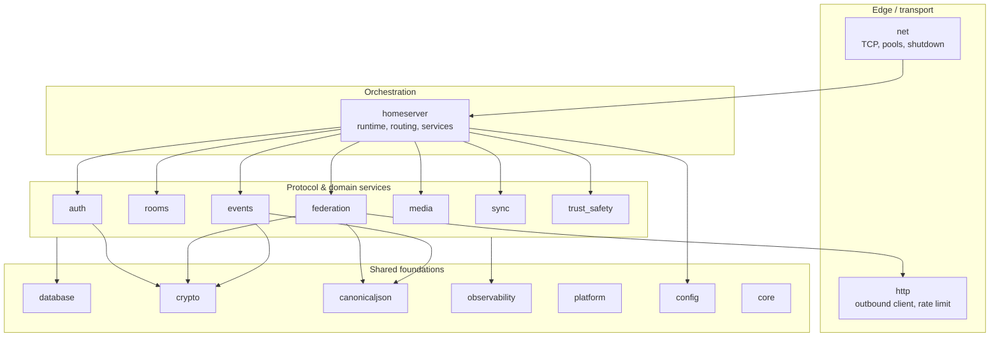
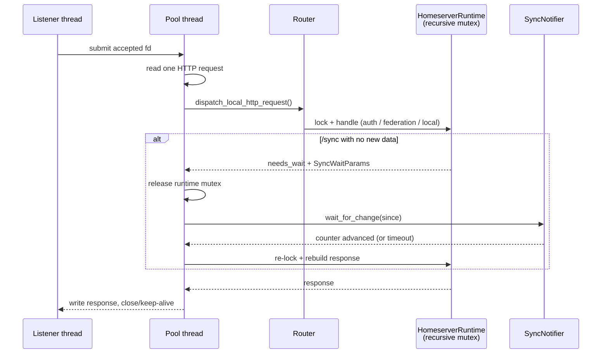
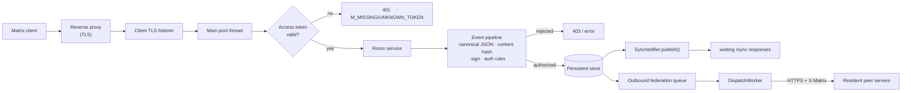
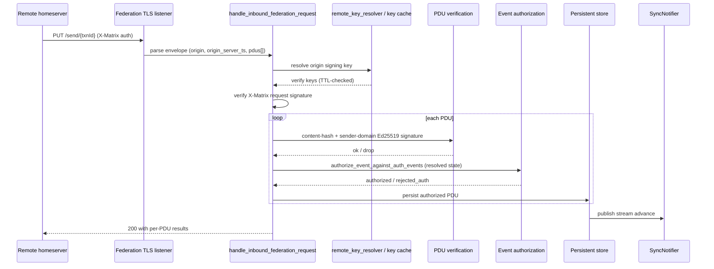
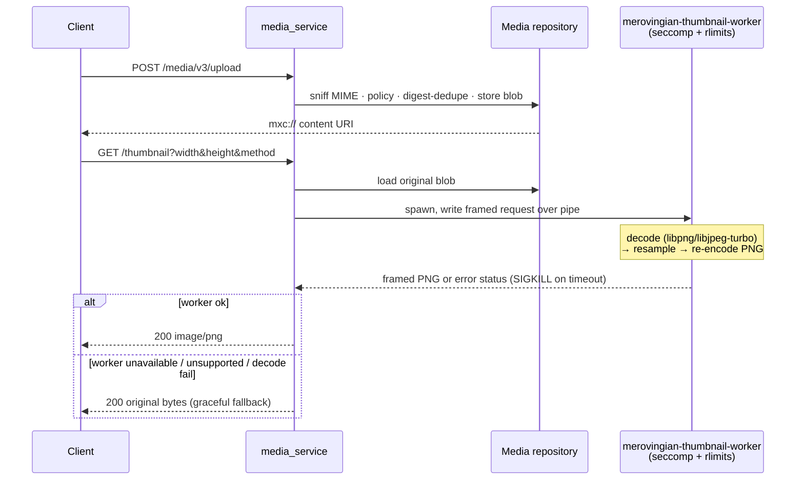

# Architecture

## Design priorities

1. Security first.
2. Correctness before features.
3. Hardened defaults.
4. Bounded resource usage.
5. Auditability.
6. Scale without bypassing checks.

## System context

Merovingian is designed to run behind a reverse proxy (which owns public TLS),
bound to loopback listeners. It talks to a SQL backend, isolates untrusted image
decoding in a sandboxed helper process, and federates with remote homeservers
over authenticated HTTPS.


```mermaid
flowchart TB
    client["Matrix client"]
    remote["Remote homeserver (federation peer)"]
    admin["Operator / admin"]
    proxy["Reverse proxy (nginx / Caddy)<br/>owns public TLS"]

    subgraph host["Merovingian host"]
        server["merovingian-server<br/>(loopback listeners)"]
        fedworker["merovingian-fed-worker × N<br/>(IPC children, sharded by room ID)"]
        thumbnail["merovingian-thumbnail-worker<br/>(sandboxed, short-lived)"]
        db[("PostgreSQL / SQLite")]
    end

    client -->|HTTPS| proxy
    admin -->|HTTPS| proxy
    proxy -->|HTTP loopback| server
    remote <-->|HTTPS + X-Matrix| server
    server -->|encrypted AF_UNIX IPC| fedworker
    server -->|spawn + pipe| thumbnail
    server -->|prepared statements| db
    fedworker -->|prepared statements| db
    server -->|outbound HTTPS, pinned IPs| remote
```

Trust boundaries are explicit: every arrow crossing into `merovingian-server`
from `client`, `remote`, or `admin` carries untrusted input and is authenticated
and validated before it reaches state. See [threat-model.md](threat-model.md).

## Source tree

Seventeen modules under `src/` and `include/merovingian/`, each compiling into a static library linked into the server and test binaries:

| Module | Purpose |
|--------|---------|
| `auth` | Sessions, tokens, key API |
| `canonicaljson` | Matrix canonical JSON parser, serializer, signing |
| `config` | Configuration parsing, validation, reload |
| `core` | Utilities: file_descriptor, query_params, secret_buffer, not_null |
| `crypto` | Ed25519 signing/verification, constant-time comparison, secure random |
| `database` | Persistence layer: PostgreSQL, SQLite, schema, migrations |
| `events` | Event parsing, authorization rules, redaction, state resolution |
| `federation` | Inbound/outbound federation, transactions, discovery |
| `homeserver` | Top-level runtime, HTTP serving, routing, auth/room/media services |
| `http` | Outbound HTTP client (libcurl), rate limiting |
| `ipc` | Encrypted AF_UNIX IPC channel (ephemeral key exchange, AEAD framing) |
| `media` | Media repository: upload, download, quarantine |
| `net` | TCP listener, thread pool, shutdown signal |
| `observability` | Logging, health checks, structured diagnostics |
| `platform` | POSIX file metadata, hardening self-checks |
| `rooms` | Room version policy, encryption policy |
| `sync` | Sync notifier, stream tokens, sync filters |
| `trust_safety` | Policy engine for moderation rules |

Entry points: `src/main.cpp` (server), `src/db_migrate.cpp` (standalone migration tool), and `src/federation_worker/main.cpp` (out-of-process federation worker).

### Module layering

Modules form a layered dependency graph. Edge transport and routing sit at the
top; protocol/domain services in the middle; shared foundations at the bottom.
Dependencies point downward — foundations never depend on services.


```mermaid
flowchart TB
    subgraph edge["Edge / transport"]
        net["net<br/>TCP, pools, shutdown"]
        http["http<br/>outbound client, rate limit"]
    end
    subgraph orchestration["Orchestration"]
        homeserver["homeserver<br/>runtime, routing, services"]
    end
    subgraph services["Protocol & domain services"]
        auth["auth"]
        rooms["rooms"]
        events["events"]
        federation["federation"]
        media["media"]
        sync["sync"]
        trust_safety["trust_safety"]
    end
    subgraph foundations["Shared foundations"]
        database["database"]
        crypto["crypto"]
        canonicaljson["canonicaljson"]
        observability["observability"]
        platform["platform"]
        config["config"]
        core["core"]
    end

    net --> homeserver
    homeserver --> auth & rooms & events & federation & media & sync & trust_safety
    federation --> http
    services --> database
    events --> crypto & canonicaljson
    federation --> crypto & canonicaljson
    auth --> crypto
    services --> observability
    homeserver --> config
```

All foundation modules depend on `core` (RAII utilities, `not_null`,
`secret_buffer`); it is the leaf of the graph.

## Runtime model

```text
merovingian-server
  ├── main pool (8 threads) — all non-sync requests
  ├── sync pool  (32 threads) — /sync long-polls only
  ├── client listener thread — plain TCP accept loop
  ├── client TLS listener thread — OpenSSL accept loop
  ├── federation listener thread — plain TCP accept loop
  ├── federation TLS listener thread — OpenSSL accept loop
  ├── DispatchWorker thread — outbound federation queue
  ├── WorkerPool — manages N WorkerSupervisor threads, one per federation shard
  └── observability pipeline

merovingian-fed-worker × N  [spawned when federation.worker.enabled=true]
  Each worker owns a subset of room IDs by FNV-1a hash of the room ID.
  ├── IPC reader thread — receives fed_request / pdu_ingest_result frames
  └── worker thread pool (threads = federation.worker.threads) — handles fed_request concurrently
```

`start_client_server(config)` returns a `ClientServerRuntime` holding `HomeserverRuntime`, which owns the persistent store, federation state, media, outbound client, discovery network, sync notifier, and a recursive mutex serialising access to the runtime.

Request flow:

1. Listener thread accepts a connection, submits the fd to the pool.
2. Pool thread reads one HTTP request, routes it via `dispatch_local_http_request()`.
3. Authenticated client-server requests go to `handle_client_server_request()`.
4. Federation requests go to `FederationProxy::handle()` (when `federation.worker.enabled=true`) which verifies the inbound X-Matrix signature itself (`verify_inbound_federation_signature`), then extracts the room ID, selects the owning worker shard (`fnv1a_32(room_id) % federation.worker.shards`), and serialises only the verified identity (`origin`/`key_id`/`sig_verified`) over the authenticated, encrypted IPC channel to that `merovingian-fed-worker` process; the raw peer `Authorization` header never crosses IPC (#323). Non-room requests route to shard 0. When the worker is disabled, requests go directly to `handle_federation_http_request()`, which performs verification in-process.
5. In-process requests (room creation that needs both auth and federation) go through `handle_local_http_request()`.
6. For `/sync` long-polls: if no new data exists, `DispatchResult::needs_wait` is returned with `SyncWaitParams`. The HTTP server releases the runtime mutex, calls `SyncNotifier::wait_for_change()`, then re-acquires the lock and rebuilds the response. This offloading keeps the main pool free for real requests.


```mermaid
sequenceDiagram
    participant L as Listener thread
    participant P as Pool thread
    participant R as Router
    participant RT as HomeserverRuntime<br/>(recursive mutex)
    participant N as SyncNotifier

    L->>P: submit accepted fd
    P->>P: read one HTTP request
    P->>R: dispatch_local_http_request()
    R->>RT: lock + handle (auth / federation / local)
    alt /sync with no new data
        RT-->>P: needs_wait + SyncWaitParams
        P->>P: release runtime mutex
        P->>N: wait_for_change(since)
        N-->>P: counter advanced (or timeout)
        P->>RT: re-lock + rebuild response
    end
    RT-->>P: response
    P-->>L: write response, close/keep-alive
```

Shutdown uses the self-pipe trick: SIGINT/SIGTERM writes to a pipe watched by `poll(2)`. Both pools drain and join, listener threads are joined, and the process exits.

## Data flow

Data crosses three trust boundaries: the client edge, the federation edge, and
the media-decode boundary. Untrusted bytes are authenticated, parsed with
bounded parsers, and validated against Matrix rules **before** they reach the
persistent store, and only validated events wake the sync notifier.

### Local event write path

A client sending a room event flows through authentication, the event pipeline
(canonical JSON → content hash → Ed25519 signing → authorization rules), and
persistence. Persisting an event publishes a sync-stream advance and queues
outbound federation delivery to resident peers.


```mermaid
flowchart LR
    client["Matrix client"] --> proxy["Reverse proxy<br/>(TLS)"]
    proxy --> listener["Client TLS listener"]
    listener --> pool["Main pool thread"]
    pool --> auth{"Access token<br/>valid?"}
    auth -- no --> reject["401 M_MISSING/UNKNOWN_TOKEN"]
    auth -- yes --> room["Room service"]
    room --> pipeline["Event pipeline<br/>canonical JSON · content hash<br/>· sign · auth rules"]
    pipeline -- rejected --> deny["403 / error"]
    pipeline -- authorized --> store[("Persistent store")]
    store --> notifier["SyncNotifier.publish()"]
    store --> outq["Outbound federation queue"]
    notifier --> waiters["waiting /sync responses"]
    outq --> dispatch["DispatchWorker"]
    dispatch -->|HTTPS + X-Matrix| peers["Resident peer servers"]
```

### Inbound federation PDU path

An inbound `PUT /send/{txnId}` transaction is authenticated at the transport
(X-Matrix), then each PDU is independently verified and authorized. Per the
Matrix spec, individual PDU failures are reported inside the response body — the
transaction still returns 200 so the peer does not back off all federation.


```mermaid
sequenceDiagram
    participant Peer as Remote homeserver
    participant FL as Federation TLS listener
    participant H as handle_inbound_federation_request
    participant K as remote_key_resolver / key cache
    participant V as PDU verification
    participant A as Event authorization
    participant S as Persistent store
    participant N as SyncNotifier

    Peer->>FL: PUT /send/{txnId} (X-Matrix auth)
    FL->>H: parse envelope (origin, origin_server_ts, pdus[])
    H->>K: resolve origin signing key
    K-->>H: verify keys (TTL-checked)
    H->>H: verify X-Matrix request signature
    loop each PDU
        H->>V: content-hash + sender-domain Ed25519 signature
        V-->>H: ok / drop
        H->>A: authorize_event_against_auth_events (resolved state)
        A-->>H: authorized / rejected_auth
        H->>S: persist authorized PDU
    end
    S->>N: publish stream advance
    H-->>Peer: 200 with per-PDU results
```

### Media upload and thumbnail path

Uploaded bytes are MIME-sniffed, policy-checked, deduplicated by content digest,
and stored. Thumbnails are generated **on demand** by spawning the sandboxed
worker; the server process never decodes untrusted image bytes itself.


```mermaid
sequenceDiagram
    participant C as Client
    participant M as media_service
    participant R as Media repository
    participant W as merovingian-thumbnail-worker<br/>(seccomp + rlimits)

    C->>M: POST /media/v3/upload
    M->>R: sniff MIME · policy · digest-dedupe · store blob
    R-->>C: mxc:// content URI
    C->>M: GET /thumbnail?width&height&method
    M->>R: load original blob
    M->>W: spawn, write framed request over pipe
    Note over W: decode (libpng/libjpeg-turbo)<br/>→ resample → re-encode PNG
    W-->>M: framed PNG or error status (SIGKILL on timeout)
    alt worker ok
        M-->>C: 200 image/png
    else worker unavailable / unsupported / decode fail
        M-->>C: 200 original bytes (graceful fallback)
    end
```

## Data types

**Config** (`config/config.hpp`): Aggregate of `ServerConfig`, `ListenersConfig`, `DatabaseConfig`, `SecurityConfig`. `DatabaseBackend` enum (`postgresql`, `sqlite`). `SecurityConfig` holds registration, encryption, federation, media, and logging sub-configs.

**JSON** (`canonicaljson/value.hpp`): `Value` is a variant of `nullptr_t`, `bool`, `int64_t`, `string`, `Array`, `Object`. `ObjectMember` holds a key and owned `Value`. `Parser` and `Serializer` handle round-tripping. `Signable` builds Matrix canonical JSON signing payloads.

**Events** (`events/event.hpp`): `EventEnvelope` carries parsed `room_id`, `event_type`, `sender`, `state_key`, `signatures`, and raw JSON. `EventSignature` is `{server_name, key_id, signature}`.

**Crypto** (`crypto/ed25519.hpp`, `signing_service.hpp`): `Ed25519Provider` (virtual) for `sign()`/`verify()`. `SigningKeyStore` (virtual) for key lookup by server name. `RuntimeSigningKeyStore` wires production key resolution through the persistent store. Libsodium provides Ed25519 signing, constant-time comparison, and secure random.

**Core utilities**: `core::not_null<T>` null-checked pointer wrapper. `core::secret_buffer` zeroes memory on destruction. `core::file_descriptor` RAII POSIX fd wrapper. `core::query_params` URL query string parser.

## Database layer

Three backends via `PersistentStoreBackend` enum: `memory` (bootstrap), `postgresql` (libpq), `sqlite` (SQLite3).

`PersistentStore` (`database/persistent_store.hpp`) is the central struct holding all in-memory data mirrors plus schema state and prepared statements. It contains vectors for: users, devices, access tokens, refresh tokens, signing keys, federation destinations/transactions, rooms, memberships, invites, events, state events, event edges/auth/signatures, device keys, OTKs, fallback keys, cross-signing keys, key backup versions/sessions, local/remote media, media blobs, audit log, policy rules, account data, to-device messages, device list changes, presence, filters, profiles, room aliases.

`DatabaseExecutor` (virtual) and `PostgresqlConnection` (concrete) handle query execution with `PreparedStatement` (named, parameterised, with `sensitive` flags for audit redaction). `SchemaState`, `MigrationStep`, and `MigrationPlan` manage schema versioning.

### Federation worker room staleness

`merovingian-fed-worker` runs its own full `HomeserverRuntime`, with its own `PersistentStore` hydrated once at worker startup (`open_sqlite_persistent_store`/`open_postgresql_persistent_store`, called from `start_runtime()`). That store is an in-memory snapshot — every write helper (`store_room`, `store_membership`, ...) writes to the database *and* pushes into that same process's in-memory vectors together, but there is no mechanism that pushes a write made by one process's `PersistentStore` into another process's copy. The only channel between worker and main is `pdu_ingest`, and it is one-way, worker → main.

Consequence: a room created, joined, or otherwise mutated through the main process's client-server API (`create_room`, `join_room`, `leave_room`, `invite_user`, `ban_user`, `kick_user`, `unban_user`) is invisible to every worker's copy of the store until that worker restarts. Since inbound federation requests (`make_join`, `send_join`, `/state`, ...) are routed to the worker, a remote server asking about a room this server just became resident in — or a remote user this server just invited to an existing, already-resident room — can get an incorrect 404, gated purely on `store.rooms` containing the room row (see `local_http_router.cpp`'s `membership_template_provider`): the room fully exists on disk and in the main process's own copy, just not in the worker's stale snapshot.

Fix: every membership-mutating room_service call (`create_room`, `join_room`, `leave_room`, `invite_user`, `ban_user`, `kick_user`, `unban_user`) calls `HomeserverRuntime::federation_proxy->notify_room_changed(room_id)` after committing the change (`FederationProxy` → `WorkerPool::notify_room_changed`, which resolves the owning shard and sends a fire-and-forget `room_sync` IPC notification — see `ipc::serialize_room_sync_notification`). The worker's IPC handler responds by calling `database::reload_room(runtime.database.persistent_store, room_id)`, which re-reads just that room's rows (room, membership, invites, events, state, and the event-relation tables scoped to that room's events) from the database and replaces the worker's in-memory slice for that room_id — not a full re-hydration. This is best-effort: a dropped notification (e.g. an unhealthy shard) is not surfaced to the caller, since a resident server that briefly serves a stale 404 to one federation peer is far cheaper than the alternative failure modes (blocking the client-facing call on cross-process delivery, or falling back to a full periodic re-hydration of every room on every worker).

`invite_user`/`ban_user`/`kick_user`/`unban_user` were originally missed by this fix — they mutate a *second* user's membership on an already-resident room rather than changing this server's own residency, which is easy to overlook when the failure mode is framed only as "residency changes." In practice this was the more common trigger: a room created once (notified fine) that later only ever receives invites/kicks/bans against it never re-syncs the worker if the room's own notify was ever dropped (e.g. the worker not yet healthy at creation time — see below), because none of the subsequent membership operations on that room notified either. Reproduced as: local user invites a remote user to an existing room, the remote user's `make_join` 404s indefinitely against every candidate server, even though the invite itself succeeded and is visible over the client-server API.

Separately, hydrating a `PersistentStore` from disk (both the full-store-open functions and `reload_room`) only loaded the flat `event_edges`/`event_auth`/`event_signatures` tables — nothing joined those back onto `PersistentEvent::prev_event_ids`/`auth_event_ids`/`signatures`, so those fields silently read back empty after any restart (they are only populated directly when an event is stored fresh within a process's own lifetime). `database::reconstruct_event_relations` fixes this and is called at the end of both full-store-open functions and as part of `reload_room`'s snapshot merge.

**Enforcing the contract in tests.** Proving a real, separate `merovingian-fed-worker` process answers an inbound request correctly for a room the main process just created is architecturally hard to test faithfully: `resolve_inbound_remote()` re-resolves the caller's identity independently on the worker side even for a request the main process already verified and forwarded pre-verified, and that resolution requires clearing a hardcoded SSRF check (`ip_address_is_private_or_loopback`) with no override reachable from outside the process — not a live test server, not a pre-seeded database cache, nothing short of weakening that check. Rather than do that, `HomeserverRuntime::test_room_changed_log` (test-only, always `nullptr` in production) lets tests assert the *design contract* directly and cheaply instead: every membership-mutating call site (`create_room`, `join_room`, `leave_room`, `invite_user`, `ban_user`, `kick_user`, `unban_user`) routes through one function, `notify_room_changed()` in `room_service.cpp`, which appends `room_id` to this vector when it is wired, in addition to (not instead of) calling `federation_proxy->notify_room_changed()`. `tests/unit/test_homeserver_room_service.cpp` pins all seven call sites this way, and `tests/integration/test_join_room_flow.cpp` pins the live federated-join path the same way. This catches a future change that adds, removes, or breaks one of those call sites as a fast, deterministic unit-test failure instead of only surfacing as a live 404 against a real federation worker.

Lifetime note for anyone adding a scenario against this hook: `join_room`'s background member-fill task captures the runtime by reference and may still call `notify_room_changed()` — writing through this pointer — after a `WHEN`/`THEN` block returns, since `HomeserverRuntime`'s destructor blocks until that task drains rather than the test waiting on it explicitly. The vector `test_room_changed_log` points at must be declared *before* the `HomeserverRuntime` variable in the test function so it destructs *after* runtime's blocking dtor has drained every orphaned future — otherwise the background task can write through a dangling pointer once the vector frees first (reproduced during development as a `corrupted size vs. prev_size in fastbins` heap-corruption abort).

**Shard routing must key on the same room ID string as the notification.** `federation.worker.shards` (default `1`) partitions rooms across independent worker processes via `federation_worker_shard_for(room_id, shards)`, an FNV-1a hash of `room_id` modulo shard count. Both `notify_room_changed()` (writer side, above) and `FederationProxy::handle()` (reader side, `federation_worker_room_id_from_request()`) must hash the *same* string for a room or its `room_sync` notification lands on a different shard than the one that later serves a request for it. `notify_room_changed()` is always called with the plain, already-decoded room ID (`!room:example.com`) since that's the internal canonical form — it never passes through a URL. `federation_worker_room_id_from_request()`, however, extracted the room ID as a raw substring of the HTTP path (`room_id_from_path_target()`), which for any client that percent-encodes `!` in the path (Synapse does, e.g. `/make_join/%21room%3Aexample.com/...`) is `%21room%3Aexample.com` — a different string, hashing to a different shard whenever `shards > 1`. The requesting shard's local `PersistentStore` never received the room, so `membership_template_provider` (`local_http_router.cpp`) legitimately found nothing and returned `404 M_NOT_FOUND`, indistinguishable from real room staleness above except that retries never heal it (the notification for this room genuinely went to a *different, otherwise-healthy* shard, not a dropped one). `room_id_from_path_target()` now percent-decodes the extracted segment (`core::percent_decode_path_component`) before returning it, so both sides key on the same canonical string. `federation.worker.shards=2` is the shipped example (`config/merovingian.conf.example`), so this was live in any deployment following it.

**Known gap: `GET /query/directory` cannot be sharded by this scheme at all.** Unlike every other room-scoped endpoint, `room_alias` here is a query parameter, not a path segment (spec: [querying for information](../../docs/matrix-v1.18-spec/server-server-api.md#querying-for-information)) — `room_endpoint_prefixes()` deliberately has no entry for it, so it always routes to shard 0 like any other non-room request. That alone isn't a full fix even in principle: the alias string and the room_id `notify_room_changed()` partitions by are unrelated strings, so hashing the alias would route to an essentially arbitrary shard, not the one that owns the room the alias points to — and `reload_room()` doesn't sync `store.room_aliases` per-room today regardless. Resolving this needs a real design decision (route to shard 0 and replicate `room_aliases` everywhere, resolve the alias in the main process before forwarding, or a dedicated non-sharded alias index), not a mechanical prefix fix.

**The staleness direction runs both ways — a worker can also write something main never learns about.** Everything above is about main's writes reaching a worker late or not at all. The reverse direction is just as real: `membership_acceptor` (backs `send_join`/`send_leave`/`send_knock`, wired via the same shared `wire_federation_callbacks_impl()` that wires `pdu_sink`'s default implementation) persisted directly into whichever process's `PersistentStore` it ran against — and since `send_join` requests are worker-routed, that's a worker's own local store, never main's. `pdu_sink` already avoids this: the worker overrides it to relay every `/send` transaction event to main via `pdu_ingest` IPC and main commits with the authoritative counter (see the comment in `worker_event_loop.cpp`: "the worker... does NOT write events"). `membership_acceptor` had no equivalent override, so a remote server's federated join — durably accepted, visible via the joining user's own client — was invisible to main's own room state. Every later `/send` message from that member is authorized by `pdu_sink` against *main's* store, which never saw the join: `event_auth`'s "sender must be joined" check (step 10, `authorization.cpp`) fails, logged only at `DEBUG` as `authorization.rejected` with no error-level signal, indistinguishable from a real "user actually isn't joined" case except that it never heals. Fix: `worker_event_loop.cpp` now overrides `membership_acceptor` the same way it overrides `pdu_sink` — serialize the endpoint + envelope into a new `membership_ingest` IPC frame, call main, deserialize the `MembershipAcceptResult` reply (including `auth_chain`/`state` for the `send_join` response body). `worker_pool.cpp`'s `handle_membership_ingest_request()` (a free function, not inlined into the IPC dispatch lambda, specifically so it has a test seam) receives it on main's side and invokes main's own unmodified `membership_acceptor` under `runtime.mutex`. Unlike `pdu_ingest`, this handler doesn't separately call `sync_notifier->publish()` — the default `membership_acceptor` already does that itself on success.

**`leave_room`'s idempotent branch also participates.** `leave_room` short-circuits before reaching `persist_membership_transition` when the caller's membership row is already something other than `"join"`/`"invite"` — per spec, leaving an already-left room is a no-op. Prior to 0.10.16 this branch returned `200` without touching `stream_ordering` or calling `notify_room_changed()`/`sync_notifier->publish()` at all. That's a trap once combined with the 0.10.15 `update_membership` bug (a membership row's `stream_ordering` frozen at its original insert value): a client whose first leave landed under that bug never saw it via `/sync` and retries `/leave`, immediately hitting this idempotent branch — which, doing nothing further, left the row stuck forever, even across a restart onto the fixed build. A repeat `/leave` call is itself the signal that the caller's view is stale, so the branch now allocates a fresh `stream_ordering`, persists it via `store_or_update_membership` (the `membership` value itself is unchanged), publishes to `sync_notifier`, and calls `notify_room_changed()` — the same self-heal on every retry, not just the first.

## Federation

**Inbound** (`federation/inbound_request.hpp`, `inbound_ingestion.hpp`): `FederationRuntimeState` holds config, remote caches, accepted transactions, and injected function hooks: `remote_key_resolver`, `pdu_sink`, `edu_sink`, `state_conflict_resolver`, `membership_template_provider`, `membership_acceptor`, `invite_handler`, `backfill_provider`, `profile_query_provider`, E2EE key hooks, event-graph query hooks. `handle_inbound_federation_request()` parses X-Matrix auth, verifies signatures, and dispatches to endpoint handlers. `PUT /_matrix/federation/v1/send/{txnId}` is strict about the Matrix transaction envelope: `origin`, `origin_server_ts`, and a `pdus` array are required, `edus` is optional but must be an array when present, empty `pdus: []` remains valid, and individual PDU failures are returned inside the `pdus` response object rather than as a non-200 transaction status.

Implemented endpoints: `PUT /send/{txnId}`, `GET/PUT /make_join`, `GET/PUT /make_leave`, `GET/PUT /make_knock`, `PUT /send_join` (v1/v2), `PUT /send_leave` (v1/v2), `PUT /send_knock` (v2), `PUT /invite` (v1/v2), `GET /event/{eventId}`, `GET /state/{roomId}`, `GET /state_ids/{roomId}`, `GET /backfill/{roomId}`, `GET /query/profile`, E2EE device keys/OTK/claim/device-list routes, `GET /_matrix/key/v2/server`. Backfill decodes URI path/query Matrix IDs before dispatch and walks stored `prev_events` from each requested event to return the requested PDU plus predecessors up to the request limit.

**Outbound** (`federation/outbound_transaction.hpp`, `dispatch_worker.hpp`): `OutboundTransaction` queued with retry state. `OutboundCall` composes resolved host/port, pinned addresses (SSRF defence), and signing identity. `DispatchWorker` drains a `std::deque<OutboundTransaction>` queue with per-destination circuit breaker and exponential backoff.

**Discovery** (`federation/server_discovery.hpp`): `ServerDiscoveryNetwork` (virtual) for `.well-known`, SRV, and direct resolution. `discover_server()` chains `.well-known` → SRV → direct with SSRF protection. `FederationDestination` tracks per-destination retry state.

**Security**: `federation_discovery_policy()` rejects private/loopback IPs. `verify_federation_request_signature()` checks Ed25519 signatures. `remote_trust_policy()` applies circuit breakers. The inbound verify/handle path is split so the main process and the worker share it: `verify_inbound_federation_signature()` (main, before IPC dispatch) and `handle_inbound_federation_request()` (worker, after IPC) both call the shared `resolve_inbound_remote` (route match, TLS origin check, server/trust policy, remote-key resolution) and `check_inbound_request_signature` (Ed25519 verify) helpers. When the worker receives a `signature_verified` request from main, it skips re-verification and trusts the forwarded `origin`/`key_id` (#323).

## Client-server API

Implemented endpoints:

- **Unauthenticated**: `GET /versions`
- **Registration & auth**: `POST /register`, `POST /login`, `POST /logout`, `POST /logout/all`, `POST /refresh`, `POST /account/password`
- **Devices**: `GET/PUT/DELETE /devices/{deviceId}`, `GET /devices`
- **Rooms**: `POST /createRoom`, `POST /join/{roomIdOrAlias}`, `POST /rooms/{roomId}/join`, `POST /rooms/{roomId}/leave`, `POST /rooms/{roomId}/forget`, `PUT /rooms/{roomId}/send`, `GET /rooms/{roomId}/state`, `GET /rooms/{roomId}/members`, `PUT /rooms/{roomId}/typing/{userId}`, `PUT /rooms/{roomId}/receipt/{receiptType}/{eventId}`
- **Sync**: `GET /sync` (long-polling with `needs_wait` offload)
- **E2EE keys**: `POST /keys/query`, `POST /keys/claim`, `GET /keys/devices/{userId}`, `PUT /keys/upload`, key backup upload/version/sessions
- **Presence**: `GET/PUT /presence/{userId}/status`
- **Profile**: `GET /profile/{userId}`, `PUT /profile/{userId}/displayname`, `PUT /profile/{userId}/avatar_url`
- **Account data**: `PUT /user/{userId}/account_data/{type}`, `PUT /user/{userId}/rooms/{roomId}/account_data/{type}`
- **Filters**: `POST /user/{userId}/filter`, `GET /user/{userId}/filter/{filterId}`
- **Directory**: `GET /publicRooms`, `PUT /directory/room/{alias}`, `GET /joined_rooms`
- **Media**: `POST /media/v3/upload`, `GET /media/v3/download/{server}/{mediaId}`, `GET /media/v3/config`
- **Admin**: `GET /admin/safety/reports`, quarantine/release/remove media
- **Other**: `GET /capabilities`, `GET /voip/turnServer`, `GET /pushrules/...`, MSC2965 OIDC discovery

## Sync subsystem

**StreamToken** (`sync/stream_token.hpp`): Triple `{event_ordering, membership_ordering, sync_stream_id}` encoded as hex string. `event_ordering` and `membership_ordering` reference the last-published stream position (not the next available slot). `sync_stream_id` covers to_device, device_lists, presence, and account_data surfaces.

**SyncNotifier** (`sync/sync_notifier.hpp`): Long-polling primitive using `std::mutex` + `std::condition_variable`. Tracks `stream_ordering_` (timeline events) and `sync_stream_id_` (sync surfaces). `publish()` wakes all waiters. `wait_for_change()` blocks until either counter advances past the client's `since` values.

**Sync flow**: Client sends `GET /sync?since=...&timeout=...`. Handler acquires the runtime mutex, builds the response. If no new data since the token, returns `DispatchResult::needs_wait` with `SyncWaitParams`. The HTTP layer releases the mutex, waits on the notifier, re-acquires the lock, and rebuilds the response. Sync waits are offloaded to the dedicated 32-thread `sync_pool`.

**`rooms.leave` timeline content**: `rooms.leave.<room_id>.timeline` must carry the room's state changes up to the point the caller left (spec) — real clients (matrix-js-sdk) derive `room.getMyMembership()` by processing that timeline's state events, not merely from the `room_id` key being present under `rooms.leave`. `build_leave_timeline_events_array()` (`client_server.cpp`) looks up the user's current `m.room.member` state event for the room in `store.state` and includes it as the sole timeline event. This is correct even on an idempotent repeat `/leave` that composed no new event, because `store_event_with_state` upserts `store.state` in place on every real transition (leave, kick, ban), so the state pointer always references the last authoritative membership event regardless of how many no-op retries followed it.

## Build system

Meson (`>=1.1.0`), C++26, `-Werror`, warning level 3. Hardening: stack protector, PIE, hidden visibility, zero-init, stack clash protection, CF protection, FORTIFY_SOURCE=3, no-exec stack. Link flags: `-Wl,-z,noexecstack`.

Dependencies: libsodium, OpenSSL, libpq (+ pgcommon/pgport), libcurl, resolv (optional) — all **system-provided** (`allow_fallback: false`). SQLite3, yyjson, and Catch2 (tests) build from source-pinned subproject wraps when no system copy is present. The thumbnail worker links system `libpng` and `libjpeg-turbo`; when those codecs are absent the worker is not built and thumbnailing falls back to original bytes. See [platform-support.md](platform-support.md) for the per-platform system-dependency package names.

Install targets: `merovingian-server`, `merovingian-db-migrate`, `merovingian-fed-worker`, and (when image codecs are present) `merovingian-thumbnail-worker` under `libexecdir/merovingian`. Sysconfdir baked in as `MEROVINGIAN_SYSCONFDIR`; the thumbnail worker path as `MEROVINGIAN_THUMBNAIL_WORKER_PATH`; the federation worker libexec directory as `MEROVINGIAN_LIBEXECDIR`. The thumbnail worker is an out-of-process, seccomp/rlimit-sandboxed image decoder so untrusted PNG/JPEG bytes are never parsed in the server process. `merovingian-fed-worker` is an out-of-process federation handler that isolates inbound federation CPU and I/O from the client-server thread pool.

## Testing

Catch2 (v3, BDD-style `SCENARIO/GIVEN/WHEN/THEN`). Unit tests in `tests/unit/`, integration tests in `tests/integration/`. Live Synapse federation tests behind `build_live_tests` option. Fuzz tests behind `build_fuzz` option. Smoke tests in `tests/smoke/`. Tooling tests in `tests/tooling/`. Complement-style JSON fixtures in `tests/fixtures/complement/`.

Tests use in-process `ClientServerRuntime` — no real HTTP server. Requests are simulated via `handle_client_server_request(runtime, {method, target, access_token, body})`. Long-poll tests use `std::thread` producers that publish through the `SyncNotifier`.

## Security

### Trust boundaries

Four boundaries separate untrusted input from server state. Each has a mandatory
gate that runs before any state mutation:

| Boundary | Untrusted source | Gate enforced before state |
|---|---|---|
| Client edge | Matrix clients | Access-token authentication, rate limiting, bounded request parsing |
| Federation edge | Remote homeservers | X-Matrix request-signature verification, per-PDU content-hash + Ed25519 verification, event authorization rules |
| IPC channel | `merovingian-fed-worker` | Master-key-authenticated `crypto_kx` handshake (#318), AEAD-encrypted frames; main verifies inbound X-Matrix signatures and forwards only the verified peer identity (`origin`/`key_id`/`sig_verified`) — the raw peer `access_token` and `Authorization`/`X-Matrix` headers never cross the boundary (#323); the Ed25519 signing secret never crosses the boundary (#317) |
| Media decode | Uploaded/fetched image bytes | Out-of-process sandboxed worker (seccomp + rlimits); the server never decodes image bytes in-process |
| Persistence | All write paths | Prepared statements only; runtime/migration role separation |

The full attacker model, surface inventory, and per-threat mitigations live in
[threat-model.md](threat-model.md).

### Principles and controls

- All external input is hostile.
- Every queue is bounded.
- Every parser is fuzzed.
- References preferred over pointers.
- RAII required.
- No custom crypto.
- Encryption enabled by default where Matrix semantics allow.
- Config file permissions enforced (no group/other write/execute).
- SSRF defence: outbound HTTP client pins resolved addresses; federation security policy rejects private/loopback IPs.
- X-Matrix auth: full Ed25519 signature verification; expired keys rejected.
- TLS mandatory for federation outbound.
- `secret_buffer` zeroes memory on destruction.
- `constant_time::equal()` for token comparison.
- Rate limiting with configurable bucket/window.
- Audit logging across auth, federation, and media boundaries.
- Trust & safety policy engine for moderation rules.
- Media security: MIME sniffing, quarantine, AV scanner flag, sandboxed decoding flag, private IP fetch blocking.
