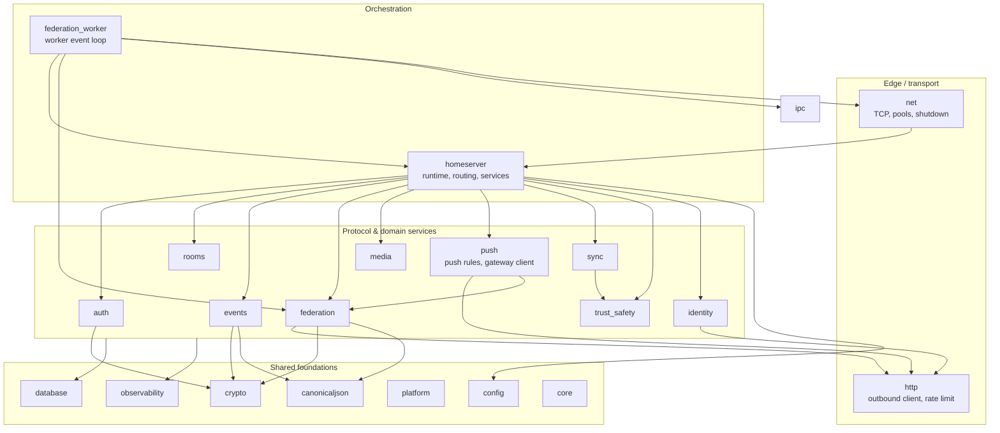
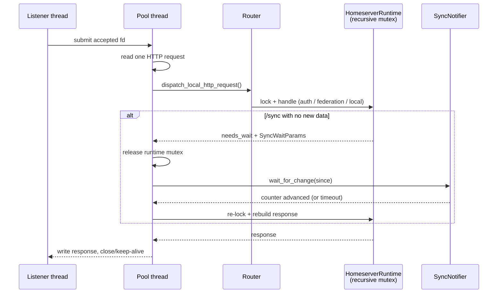
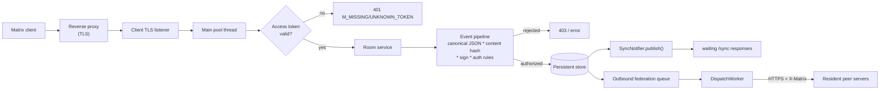
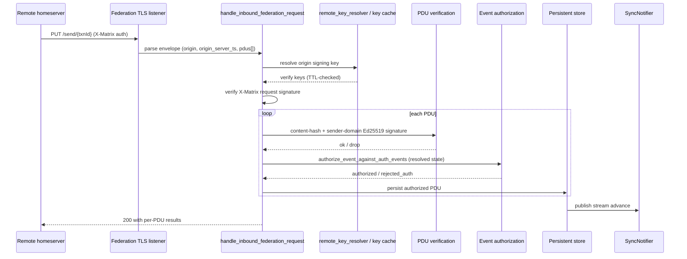

# Architecture

## Design priorities

1. Security first.
2. Correctness before features.
3. Hardened defaults.
4. Bounded resource usage.
5. Auditability.
6. Scale without bypassing checks.

## System context

Merovingian is designed to run behind a reverse proxy (which owns public TLS),
bound to loopback listeners. It talks to a SQL backend, isolates untrusted image
decoding in a sandboxed helper process, and federates with remote homeservers
over authenticated HTTPS.


```mermaid
flowchart TB
    client["Matrix client"]
    remote["Remote homeserver (federation peer)"]
    admin["Operator / admin"]
    proxy["Reverse proxy (nginx / Caddy)<br/>owns public TLS"]

    subgraph host["Merovingian host"]
        server["merovingian-server<br/>(loopback listeners)"]
        fedworker["merovingian-fed-worker x N<br/>(IPC children, sharded by room ID)"]
        thumbnail["merovingian-thumbnail-worker<br/>(sandboxed, short-lived)"]
        db[("PostgreSQL / SQLite")]
    end

    client -->|HTTPS| proxy
    admin -->|HTTPS| proxy
    proxy -->|HTTP loopback| server
    remote <-->|HTTPS + X-Matrix| server
    server -->|encrypted AF_UNIX IPC| fedworker
    server -->|spawn + pipe| thumbnail
    server -->|prepared statements| db
    fedworker -->|prepared statements| db
    server -->|outbound HTTPS, pinned IPs| remote
```

Trust boundaries are explicit: every arrow crossing into `merovingian-server`
from `client`, `remote`, or `admin` carries untrusted input and is authenticated
and validated before it reaches state. See [threat-model.md](threat-model.md).

## Source tree

The production code is split into mirrored modules under `src/` and
`include/merovingian/`. Most modules compile into static libraries linked into
the server, worker, migration tool, and tests; `bootstrap` is currently a
header-only public boundary.

| Module | Purpose |
|--------|---------|
| `auth` | Sessions, tokens, key API |
| `bootstrap` | Public bootstrap boundary for startup integration |
| `canonicaljson` | Matrix canonical JSON parser, serializer, signing |
| `config` | Configuration parsing, validation, reload |
| `core` | Utilities: file_descriptor, query_params, secret_buffer, not_null |
| `crypto` | Ed25519 signing/verification, constant-time comparison, secure random |
| `database` | Persistence layer: PostgreSQL, SQLite, schema, migrations |
| `events` | Event parsing, authorization rules, redaction, state resolution |
| `federation` | Inbound/outbound federation, transactions, discovery |
| `federation_worker` | Worker CLI parsing and event loop for out-of-process federation |
| `homeserver` | Top-level runtime, HTTP serving, routing, auth/room/media services |
| `http` | Outbound HTTP client (libcurl), rate limiting |
| `identity` | Outbound Identity Service API client (3PID store-invite, lookup, bind, unbind, requestToken) |
| `ipc` | Encrypted AF_UNIX IPC channel (ephemeral key exchange, AEAD framing) |
| `media` | Media repository: upload, download, quarantine |
| `net` | TCP listener, thread pool, shutdown signal |
| `observability` | Logging, health checks, structured diagnostics |
| `platform` | POSIX file metadata, hardening self-checks |
| `rooms` | Room version policy, encryption policy |
| `sync` | Sync notifier, stream tokens, sync filters, MSC4186 sliding sync |
| `trust_safety` | Policy engine for moderation rules; `m.ignored_user_list` delivery-filter enforcement (`ignore_list`) |

Entry points: `src/main.cpp` (`merovingian-server`), `src/db_migrate.cpp`
(`merovingian-db-migrate`), `src/federation_worker/main.cpp`
(`merovingian-fed-worker`), and `src/media/thumbnail_worker_main.cpp`
(`merovingian-thumbnail-worker` when image codec dependencies are present).

### Module layering

Modules form a layered dependency graph. Edge transport and routing sit at the
top; protocol/domain services in the middle; shared foundations at the bottom.
Dependencies point downward - foundations never depend on services.


```mermaid
flowchart TB
    subgraph edge["Edge / transport"]
        net["net<br/>TCP, pools, shutdown"]
        http["http<br/>outbound client, rate limit"]
    end
    subgraph orchestration["Orchestration"]
        homeserver["homeserver<br/>runtime, routing, services"]
        fedworker_mod["federation_worker<br/>worker event loop"]
    end
    subgraph services["Protocol & domain services"]
        auth["auth"]
        rooms["rooms"]
        events["events"]
        federation["federation"]
        identity["identity"]
        media["media"]
        push["push<br/>push rules, gateway client"]
        sync["sync"]
        trust_safety["trust_safety"]
    end
    subgraph foundations["Shared foundations"]
        database["database"]
        crypto["crypto"]
        canonicaljson["canonicaljson"]
        observability["observability"]
        platform["platform"]
        config["config"]
        core["core"]
    end

    net --> homeserver
    fedworker_mod --> homeserver & federation & ipc & net
    homeserver --> auth & rooms & events & federation & media & push & sync & trust_safety & identity
    federation --> http
    identity --> http
    push --> http & federation
    sync --> trust_safety
    services --> database
    events --> crypto & canonicaljson
    federation --> crypto & canonicaljson
    auth --> crypto
    services --> observability
    homeserver --> config
```

All foundation modules depend on `core` (RAII utilities, `not_null`,
`secret_buffer`); it is the leaf of the graph.

## Runtime model

```text
merovingian-server
  - main pool (8 threads): all non-sync requests
  - sync pool (32 threads): `/sync` long-polls only
  - client listener thread: plain TCP accept loop
  - client TLS listener thread: OpenSSL accept loop
  - federation listener thread: plain TCP accept loop
  - federation TLS listener thread: OpenSSL accept loop
  - DispatchWorker thread: outbound federation queue
  - WorkerPool: manages N WorkerSupervisor threads, one per federation shard,
    plus a handler pool that runs worker-to-main IPC request handlers off the
    per-channel dispatch thread
  - observability pipeline

merovingian-fed-worker x N  [spawned when federation.worker.enabled=true]
  Each worker owns a subset of room IDs by FNV-1a hash of the room ID.
  - IPC reader thread: routes frames only — responses wake pending waiters,
    request frames are queued for the IPC dispatch thread
  - IPC dispatch thread: invokes the request handler for queued frames in order
  - local_pool (threads = federation.worker.threads): local room-scoped reads and `room_sync` reloads
  - relay_pool (threads = federation.worker.relay_threads): main-process relays and outbound HTTP
```

`start_client_server(config)` returns a `ClientServerRuntime` holding `HomeserverRuntime`, which owns the persistent store, federation state, media, outbound client, discovery network, sync notifier, and a recursive mutex serialising access to the runtime.

Request flow:

1. Listener thread accepts a connection, submits the fd to the pool.
2. Pool thread reads one HTTP request, routes it via `dispatch_local_http_request()`.
3. Authenticated client-server requests go to `handle_client_server_request()`.
4. Federation requests go to `FederationProxy::handle()` (when `federation.worker.enabled=true`) which verifies the inbound X-Matrix signature itself (`verify_inbound_federation_signature`), then extracts and percent-decodes the room ID, selects the owning worker shard (`fnv1a_32(room_id) % federation.worker.shards`), and serialises only the verified identity (`origin`/`key_id`/`sig_verified`) over the authenticated, encrypted IPC channel to that `merovingian-fed-worker` process; the raw peer `Authorization` header never crosses IPC (#323). Non-room requests route to shard 0. When the worker is disabled, requests go directly to `handle_federation_http_request()`, which performs verification in-process.
5. In-process requests (room creation that needs both auth and federation) go through `handle_local_http_request()`.
6. For `/sync` long-polls: if no new data exists, `DispatchResult::needs_wait` is returned with `SyncWaitParams`. The HTTP server releases the runtime mutex, calls `SyncNotifier::wait_for_change()`, then re-acquires the lock and rebuilds the response. This offloading keeps the main pool free for real requests.

**Fire-and-forget background work.** Some work must start from inside a
request handler but must not make the client wait on it: `join_room`'s
background member-fill (deferred verification of the bulk member list after
a fast join) and, since v0.11.11, push notification delivery
(`room_service.cpp`'s `dispatch_push_deliveries`, reached from
`send_event()` — `/send` and `/state` — and from every membership-mutating
path: invite, join, leave, kick, ban, knock, and the 3PID invite, via
`dispatch_membership_push_notification()`) both use the same pattern rather
than a dedicated thread pool. The handler snapshots everything it needs
*while it still holds `runtime.mutex`* (for push delivery: which pushers to
notify, and the already-built notification bodies — no I/O), then submits a
`std::async(std::launch::async, [&runtime, ...]{ ... })` task that performs
the actual network calls without the lock, re-acquiring it only briefly to
persist an outcome (e.g. deleting a pusher the gateway rejected). The
resulting `std::future` is parked in `HomeserverRuntime::orphan_futures_`
(guarded by `orphan_futures_mutex_`); the runtime's destructor blocks on
every parked future before any of its other members (`outbound_client`,
`cached_discovery`, the persistent store) are torn down, so the task's
captured `runtime&` reference is always valid for as long as it can run.
Both call sites now share one reaping policy, `reap_completed_futures()`
(`runtime.hpp`/`.cpp`): every already-finished future is removed from
`orphan_futures_` before a new one is parked, so the vector does not grow
unboundedly over the runtime's lifetime. Push delivery additionally bounds
*concurrent* tasks — not just the vector's steady-state size — via
`HomeserverRuntime::push_delivery_in_flight_`, a `std::atomic<std::size_t>`
(tracked separately from the make_join race's use of the same vector so the
two do not starve each other) checked against a fixed cap
(`k_max_in_flight_push_deliveries`, 128) before a task is spawned; at
capacity the delivery is dropped and logged rather than spawned, since a
missed push is recoverable but unbounded thread creation is not (see
`threat-model.md`, "Push delivery background tasks were unbounded"). The
dispatcher-side check-and-increment happens under `orphan_futures_mutex_`
(already held there to reap `orphan_futures_`), but the background task's
own decrement deliberately does not take that mutex: a task's completion
must never depend on acquiring a lock a waiter might be holding across a
blocking `future.wait()` on that very task. Both waiters
(`~HomeserverRuntime()` and the integration test's
`wait_for_background_tasks()`) hold `orphan_futures_mutex_` only long enough
to move the parked futures out of `orphan_futures_` before waiting on the
moved-out copies with the mutex released, for exactly this reason (see
`threat-model.md`, "The in-flight counter above deadlocked runtime
shutdown"). Tests wait on the same vector instead of sleeping — see
`tests/integration/test_join_room_flow.cpp` and
`tests/integration/test_push_delivery_flow.cpp`.


```mermaid
sequenceDiagram
    participant L as Listener thread
    participant P as Pool thread
    participant R as Router
    participant RT as HomeserverRuntime<br/>(recursive mutex)
    participant N as SyncNotifier

    L->>P: submit accepted fd
    P->>P: read one HTTP request
    P->>R: dispatch_local_http_request()
    R->>RT: lock + handle (auth / federation / local)
    alt /sync with no new data
        RT-->>P: needs_wait + SyncWaitParams
        P->>P: release runtime mutex
        P->>N: wait_for_change(since)
        N-->>P: counter advanced (or timeout)
        P->>RT: re-lock + rebuild response
    end
    RT-->>P: response
    P-->>L: write response, close/keep-alive
```

Shutdown uses the self-pipe trick: SIGINT/SIGTERM writes to a pipe watched by `poll(2)`. Both pools drain and join, listener threads are joined, and the process exits.

## Data flow

Data crosses five trust boundaries: the client edge, federation edge, IPC
channel, media-decode boundary, and persistence boundary. Untrusted bytes are
authenticated, parsed with bounded parsers, and validated against Matrix rules
**before** they reach the persistent store, and only validated events wake the
sync notifier.

### Local event write path

A client sending a room event flows through authentication, the event pipeline
(canonical JSON -> content hash -> Ed25519 signing -> authorization rules), and
persistence. Persisting an event publishes a sync-stream advance and queues
outbound federation delivery to resident peers.


```mermaid
flowchart LR
    client["Matrix client"] --> proxy["Reverse proxy<br/>(TLS)"]
    proxy --> listener["Client TLS listener"]
    listener --> pool["Main pool thread"]
    pool --> auth{"Access token<br/>valid?"}
    auth -- no --> reject["401 M_MISSING/UNKNOWN_TOKEN"]
    auth -- yes --> room["Room service"]
    room --> pipeline["Event pipeline<br/>canonical JSON * content hash<br/>* sign * auth rules"]
    pipeline -- rejected --> deny["403 / error"]
    pipeline -- authorized --> store[("Persistent store")]
    store --> notifier["SyncNotifier.publish()"]
    store --> outq["Outbound federation queue"]
    notifier --> waiters["waiting /sync responses"]
    outq --> dispatch["DispatchWorker"]
    dispatch -->|HTTPS + X-Matrix| peers["Resident peer servers"]
```

### Inbound federation PDU path

An inbound `PUT /send/{txnId}` transaction is authenticated at the transport
(X-Matrix), then each PDU is independently verified and authorized. Per the
Matrix spec, individual PDU failures are reported inside the response body - the
transaction still returns 200 so the peer does not back off all federation.


```mermaid
sequenceDiagram
    participant Peer as Remote homeserver
    participant FL as Federation TLS listener
    participant H as handle_inbound_federation_request
    participant K as remote_key_resolver / key cache
    participant V as PDU verification
    participant A as Event authorization
    participant S as Persistent store
    participant N as SyncNotifier

    Peer->>FL: PUT /send/{txnId} (X-Matrix auth)
    FL->>H: parse envelope (origin, origin_server_ts, pdus[])
    H->>K: resolve origin signing key
    K-->>H: verify keys (TTL-checked)
    H->>H: verify X-Matrix request signature
    loop each PDU
        H->>V: content-hash + sender-domain Ed25519 signature
        V-->>H: ok / drop
        H->>A: authorize_event_against_auth_events (resolved state)
        A-->>H: authorized / rejected_auth
        H->>S: persist authorized PDU
    end
    S->>N: publish stream advance
    H-->>Peer: 200 with per-PDU results
```

### Media upload and thumbnail path

Uploaded bytes are MIME-sniffed, policy-checked, deduplicated by content digest,
and stored. Thumbnails are generated **on demand** by spawning the sandboxed
worker; the server process never decodes untrusted image bytes itself.


```mermaid
sequenceDiagram
    participant C as Client
    participant M as media_service
    participant R as Media repository
    participant W as merovingian-thumbnail-worker<br/>(seccomp + rlimits)

    C->>M: POST /media/v3/upload
    M->>R: sniff MIME * policy * digest-dedupe * store blob
    R-->>C: mxc:// content URI
    C->>M: GET /thumbnail?width&height&method
    M->>R: load original blob
    M->>W: spawn, write framed request over pipe
    Note over W: decode (libpng/libjpeg-turbo)<br/>-> resample -> re-encode PNG
    W-->>M: framed PNG or error status (SIGKILL on timeout)
    alt worker ok
        M-->>C: 200 image/png
    else worker unavailable / unsupported / decode fail
        M-->>C: 200 original bytes (graceful fallback)
    end
```

## Data types

**Config** (`config/config.hpp`): Aggregate of `ServerConfig`, `ListenersConfig`, `DatabaseConfig`, `SecurityConfig`. `DatabaseBackend` enum (`postgresql`, `sqlite`). `SecurityConfig` holds registration, encryption, federation, media, and logging sub-configs.

**JSON** (`canonicaljson/value.hpp`): `Value` is a variant of `nullptr_t`, `bool`, `int64_t`, `string`, `Array`, `Object`. `ObjectMember` holds a key and owned `Value`. `Parser` and `Serializer` handle round-tripping. `Signable` builds Matrix canonical JSON signing payloads.

**Events** (`events/event.hpp`): `EventEnvelope` carries parsed `room_id`, `event_type`, `sender`, `state_key`, `signatures`, and raw JSON. `EventSignature` is `{server_name, key_id, signature}`.

**Crypto** (`crypto/ed25519.hpp`, `signing_service.hpp`): `Ed25519Provider` (virtual) for `sign()`/`verify()`. `SigningKeyStore` (virtual) for key lookup by server name. `RuntimeSigningKeyStore` wires production key resolution through the persistent store. Libsodium provides Ed25519 signing, constant-time comparison, and secure random.

**Core utilities**: `core::not_null<T>` null-checked pointer wrapper. `core::secret_buffer` zeroes memory on destruction. `core::file_descriptor` RAII POSIX fd wrapper. `core::query_params` URL query string parser.

## Database layer

Three backends via `PersistentStoreBackend` enum: `memory` (bootstrap), `postgresql` (libpq), `sqlite` (SQLite3).

`PersistentStore` (`database/persistent_store.hpp`) is the central struct holding all in-memory data mirrors plus schema state and prepared statements. It contains vectors for: users, devices, access tokens, refresh tokens, signing keys, federation destinations/transactions, rooms, memberships, invites, events, state events, event edges/auth/signatures, device keys, OTKs, fallback keys, cross-signing keys, key backup versions/sessions, local/remote media, media blobs, audit log, policy rules, account data, to-device messages, device list changes, presence, filters, profiles, room aliases.

`DatabaseExecutor` (virtual) and `PostgresqlConnection` (concrete) handle query execution with `PreparedStatement` (named, parameterised, with `sensitive` flags for audit redaction). `SchemaState`, `MigrationStep`, and `MigrationPlan` manage schema versioning.

### Per-room inbound PDU ingestion

Inbound federation PDUs used to be ingested while holding the global `HomeserverRuntime::mutex` for the entire auth, persistence, membership-update, and sync-notification path. Under a burst of 30–40 events this serialized every PDU behind the previous one's database commit, turning quick succession into a drip-feed even though the SQLite/PostgreSQL backends open a fresh connection per transaction and could otherwise overlap.

`HomeserverRuntime` now owns `std::array<std::mutex, 256>` room-stripe mutexes keyed by `std::hash<std::string>(room_id) % 256`. The default `pdu_sink` reserves only a global `stream_ordering` token and `sync_stream_id` under the global lock, then calls `ingest_pdu_event()`:

1. Validate the envelope (`room_id`, `room_version`, canonical JSON, content hash, sender signature already verified upstream).
2. Lock the room's stripe mutex.
3. Build the auth map and run `authorize_event_against_auth_events`.
4. Prepare the persistent update with `database::prepare_store_event_with_state()`.
5. Unlock the global `runtime.mutex` and commit the prepared statements with `database::commit_persistent_transaction()`, so commits for different rooms can overlap while each room's stripe remains held for ordering.
6. Re-lock the global `runtime.mutex` and call `database::apply_store_event_with_state()` to mirror the committed rows into the in-memory vectors.
7. Update membership and the runtime's `LocalRoom` view while still under the stripe lock.

This preserves ordering within a single room (all events for that room serialize on the same stripe) while allowing independent rooms to prepare, commit, and apply concurrently. The global `runtime.mutex` is no longer held across database commits.

`handle_federation_http_request()` also avoids holding `HomeserverRuntime::mutex` across the federation core. It locks only long enough to check startup state, wire callbacks, publish `/_matrix/key/v2/server`, build the verified signed request, and evaluate local trust-safety policy; `handle_inbound_federation_request()` then runs without the global homeserver lock. `FederationRuntimeState` owns a federation-local mutex for its own mutable bookkeeping (`remotes`, accepted transaction IDs, and audit events), while production hooks such as `pdu_sink` and `edu_sink` re-enter `HomeserverRuntime` through their narrower existing locks. This prevents a worker shard from serializing whole `/send` transactions while each relayed PDU/EDU waits on worker-to-main IPC.

### Federation worker consistency model

`merovingian-fed-worker` runs a full `HomeserverRuntime` with its own `PersistentStore` snapshot hydrated at worker startup. Main remains authoritative for client-visible state; worker-local state is used only for room-scoped federation reads that can be refreshed from the database.

Room-scoped changes call `notify_room_changed(room_id)` after commit. The proxy hashes the decoded room ID with FNV-1a modulo `federation.worker.shards`, sends a best-effort `room_sync` IPC frame to the owning shard, and the worker reloads that room with `database::reload_room()`. The reload covers the room, memberships, invites, events, state, and event relation tables; it is not a full-store rehydrate. Hydration and room reloads call `database::reconstruct_event_relations()` so stored `prev_event_ids`, `auth_event_ids`, and signatures are rebuilt from their normalized tables.

Shard selection must use the same decoded room ID string on both sides. Writer-side notifications use the internal room ID, while federation paths can percent-encode Matrix IDs; `federation_worker_room_id_from_request()` decodes path components before hashing. Routes without a room ID, including `GET /_matrix/federation/v1/query/directory` and `GET /_matrix/federation/v1/event/{eventId}`, cannot be sharded by room from the request path alone. Verified EDU-only `PUT /_matrix/federation/v1/send/{txnId}` transactions are handled in main rather than routed to shard 0, because they ultimately call main's `edu_sink` and include E2EE to-device key shares.

Workers relay operations that must observe main's current global state or must commit to main exactly once. Relayed hooks include `pdu_sink`, `edu_sink`, `membership_acceptor`, `invite_handler`, `one_time_keys_claim_provider`, `user_devices_provider`, `device_keys_query_provider`, `profile_query_provider`, and `event_query_provider`. This keeps inbound PDUs/EDUs, federated joins/leaves/knocks, invites, one-time-key claims, device/profile reads, and event-by-ID reads consistent with the store that client `/sync` uses.

Worker request execution uses two pools. `local_pool` (`federation.worker.threads`) handles endpoints answered from the worker room snapshot: `make_join`, `make_leave`, `make_knock`, `backfill`, `query/directory`, `state`, `state_ids`, `get_missing_events`, `hierarchy`, and the no-op EDU route. `relay_pool` (`federation.worker.relay_threads`) handles endpoints that can block on main or outbound HTTP: PDU-bearing transactions, `send_join`, `send_leave`, `send_knock`, invites, key/profile/device relays, event-by-ID, and `outbound_http_request`. The split is driven by `federation::federation_endpoint_requires_main_relay(FederationEndpoint)` so slow relays cannot starve local room reads of worker threads.

### IPC reader/dispatch split

`ipc::IpcChannel` runs two threads per channel end. The reader thread only routes frames: a `reply_to` frame wakes its pending `send_request` waiter, and request frames are queued for the dispatch thread, which invokes the registered request handler one frame at a time in arrival order. The reader must never run handler code: a handler that blocks on a lock held by a thread that is itself waiting inside `send_request` on the same channel would otherwise wedge frame routing until the `send_request` timeout. That exact cycle previously occurred on every relayed PDU: the worker's relay thread held the worker `runtime.mutex` across its `pdu_ingest` round trip to main, main's `pdu_ingest` handler sent a `room_sync` notification (whose handler needs that same worker mutex) immediately before the `pdu_ingest` response, and the worker's reader thread blocked on the notification before it could route the response — a 60-second stall per PDU that remote origins turned into retry-with-backoff drip feed. The mirror case existed on main: a client-server handler holding main's `runtime.mutex` across a proxied outbound call (e.g. remote `/keys/query`) starved main's reader from routing the worker's `outbound_http_response` whenever a `pdu_ingest` arrived first and blocked inline on the same mutex. For the same reason, the worker handles `room_sync` on `local_pool` rather than on the dispatch thread: `reload_room` needs `runtime.mutex`, and blocking the dispatch thread on it would delay every later queued request frame. On the main side, `WorkerPool` runs every worker-to-main request handler (`pdu_ingest`, `membership_ingest`, `edu_ingest`, `invite_ingest`, query-provider relays, and `sign_request`) on a dedicated handler pool sized from `federation.worker.relay_threads`; the per-channel IPC dispatch thread only classifies the frame and enqueues the work. This means a slow `pdu_ingest` — which reserves a global stream-ordering token, acquires its room stripe, prepares the update, releases the global runtime lock for the backend commit, and re-acquires it only to apply the result and update membership — no longer serializes all later request frames on that channel behind it, eliminating the single-dispatch-thread throughput bottleneck that made high-rate inbound federation back up and drip-feed. `WorkerPool::stop()` drains `handler_pool_` before stopping the supervisors so no handler thread races the closing channel. Because the handler pool can still be running a `pdu_ingest` when `WorkerSupervisor` needs to stop or restart, the supervisor takes ownership of the `IpcChannel` under `channel_mu_` and releases the lock before calling `IpcChannel::stop()`; otherwise `stop()`'s join of the dispatch thread would deadlock against the same handler calling back into `channel_snapshot()` via `notify_room_changed()`. `WorkerSupervisor::stop()` also bounds its final `waitpid` with `WNOHANG` and escalates through `SIGTERM` to `SIGKILL`, so a TSan-slow or stuck worker child cannot block process shutdown or test teardown.

## Federation

**Inbound** (`federation/inbound_request.hpp`, `inbound_ingestion.hpp`): `FederationRuntimeState` holds config, remote caches, accepted transactions, audit events, and injected function hooks: `remote_key_resolver`, `pdu_sink`, `edu_sink`, `state_conflict_resolver`, `membership_template_provider`, `membership_acceptor`, `invite_handler`, `backfill_provider`, `profile_query_provider`, E2EE key hooks, event-graph query hooks. Its federation-local mutex protects remote-cache/trust updates, accepted transaction IDs, and audit events when multiple federation requests run concurrently. `handle_inbound_federation_request()` parses X-Matrix auth, verifies signatures, and dispatches to endpoint handlers. `PUT /_matrix/federation/v1/send/{txnId}` follows the Matrix v1.19 transaction envelope: `origin`, `origin_server_ts`, and a `pdus` array are required, `edus` is optional but must be an array when present, empty `pdus: []` remains valid, and individual PDU failures are returned inside the `pdus` response object rather than as a non-200 transaction status. See [Server-Server API: Request Authentication](matrix-v1.19-spec/server-server-api.md#request-authentication), [Transactions](matrix-v1.19-spec/server-server-api.md#transactions), [Authorization rules](matrix-v1.19-spec/server-server-api.md#authorization-rules), and [Signing Events](matrix-v1.19-spec/server-server-api.md#signing-events).

Implemented endpoints: `PUT /send/{txnId}`, `GET/PUT /make_join`, `GET/PUT /make_leave`, `GET/PUT /make_knock`, `PUT /send_join` (v1/v2), `PUT /send_leave` (v1/v2), `PUT /send_knock` (v2), `PUT /invite` (v1/v2), `GET /event/{eventId}`, `GET /state/{roomId}`, `GET /state_ids/{roomId}`, `GET /backfill/{roomId}`, `POST /get_missing_events/{roomId}`, `GET /hierarchy/{roomId}`, `GET /query/directory`, `GET /query/profile`, `GET/POST /publicRooms`, E2EE device keys/OTK/claim/device-list routes, and `GET /_matrix/key/v2/server`. Backfill decodes URI path/query Matrix IDs before dispatch and walks stored `prev_events` from each requested event to return the requested PDU plus predecessors up to the request limit. See [Joining Rooms](matrix-v1.19-spec/server-server-api.md#joining-rooms), [Backfilling and retrieving missing events](matrix-v1.19-spec/server-server-api.md#backfilling-and-retrieving-missing-events), [Room State Resolution](matrix-v1.19-spec/server-server-api.md#room-state-resolution), [Published Room Directory](matrix-v1.19-spec/server-server-api.md#published-room-directory), and [Retrieving server keys](matrix-v1.19-spec/server-server-api.md#retrieving-server-keys).

**Outbound** (`federation/outbound_transaction.hpp`, `dispatch_worker.hpp`): `OutboundTransaction` queued with retry state. `OutboundCall` composes resolved host/port, pinned addresses (SSRF defence), and signing identity. `DispatchWorker` drains a `std::deque<OutboundTransaction>` queue with per-destination circuit breaker and exponential backoff. These controls govern Merovingian sending to remote homeservers; they are separate from inbound `/send` abuse controls, which key on the authenticated remote origin sending traffic to Merovingian.

**Discovery** (`federation/server_discovery.hpp`): `ServerDiscoveryNetwork` (virtual) for `.well-known`, SRV, and direct resolution. `discover_server()` chains `.well-known` -> SRV -> direct with SSRF protection. `FederationDestination` tracks per-destination retry state. See [Server discovery](matrix-v1.19-spec/server-server-api.md#server-discovery).

**Security**: `federation_discovery_policy()` rejects private/loopback IPs. `verify_federation_request_signature()` checks Ed25519 signatures. `remote_trust_policy()` applies circuit breakers. Inbound `/send` applies Matrix v1.19 transaction count caps (50 PDUs, 100 EDUs by default) and authenticated per-origin transaction/PDU/EDU rate buckets after request signature verification; origin-level pressure returns `429 M_LIMIT_EXCEEDED`, while individual invalid PDUs remain per-PDU errors in a `200` transaction response. The inbound verify/handle path is split so the main process and the worker share it: `verify_inbound_federation_signature()` (main, before IPC dispatch) and `handle_inbound_federation_request()` (worker, after IPC) both call the shared `resolve_inbound_remote` (route match, TLS origin check, server/trust policy, remote-key resolution) and `check_inbound_request_signature` (Ed25519 verify) helpers. When the worker receives a `signature_verified` request from main, it skips re-verification and trusts the forwarded `origin`/`key_id` (#323).

**Server ACLs** (`federation/server_acl.hpp`, `server_acl.cpp`): per-room `m.room.server_acl` enforcement (MSC4436). `evaluate_server_acl()` strips ports, checks `allow_ip_literals`, applies deny-then-allow glob lists case-insensitively, and fail-closes to deny when an allow list exists and the server does not match. `room_server_acl_allows()` loads the current ACL from the persistent store. `FederationRuntimeState` carries a `room_server_acl_provider` hook so the inbound path can reject protected endpoints, per-PDU transaction entries, and room-local EDUs (`m.typing`, `m.receipt`) before they reach room state.

## Client-server API

Implemented endpoints are grouped below. Matrix v1.19 behaviour is described in [Client Authentication](matrix-v1.19-spec/client-server-api.md#client-authentication), [Room event format](matrix-v1.19-spec/client-server-api.md#room-event-format), [Rooms](matrix-v1.19-spec/client-server-api.md#rooms), [Syncing](matrix-v1.19-spec/client-server-api.md#syncing), and the media endpoints under the [Client-Server API](matrix-v1.19-spec/client-server-api.md).

- **Unauthenticated**: `GET /versions`
- **Registration & auth**: `POST /register`, `POST /login`, `POST /logout`, `POST /logout/all`, `POST /refresh`, `POST /account/password`, account 3PID request/add/bind/unbind/delete/list routes
- **Devices**: `GET/PUT/DELETE /devices/{deviceId}`, `GET /devices`, `POST /delete_devices`
- **Rooms**: `POST /createRoom`, `POST /join/{roomIdOrAlias}`, `POST /knock/{roomIdOrAlias}`, `POST /rooms/{roomId}/join`, `POST /rooms/{roomId}/leave`, `POST /rooms/{roomId}/forget`, `POST /rooms/{roomId}/invite`, `POST /rooms/{roomId}/kick`, `POST /rooms/{roomId}/ban`, `POST /rooms/{roomId}/unban`, `PUT /rooms/{roomId}/send`, `PUT /rooms/{roomId}/state`, `GET /rooms/{roomId}/state`, `GET /rooms/{roomId}/members`, `GET /rooms/{roomId}/joined_members`, `PUT /rooms/{roomId}/typing/{userId}`, `PUT /rooms/{roomId}/receipt/{receiptType}/{eventId}`
- **Sync**: `GET /sync` and MSC4186 sliding sync unstable routes (long-polling with `needs_wait` offload)
- **E2EE keys**: `POST /keys/query`, `POST /keys/claim`, `GET /keys/devices/{userId}`, `GET /keys/changes`, `PUT /keys/upload`, `PUT /sendToDevice/{eventType}/{txnId}`, cross-signing and key backup routes
- **Presence**: `GET/PUT /presence/{userId}/status`
- **Profile**: `GET /profile/{userId}`, `PUT /profile/{userId}/displayname`, `PUT /profile/{userId}/avatar_url`
- **Account data**: `PUT /user/{userId}/account_data/{type}`, `PUT /user/{userId}/rooms/{roomId}/account_data/{type}`
- **Filters**: `POST /user/{userId}/filter`, `GET /user/{userId}/filter/{filterId}`
- **Directory**: `GET/POST /publicRooms`, `GET/PUT /directory/room/{alias}`, `GET /joined_rooms`
- **Media**: `POST /media/v3/upload`, `GET /media/v3/download/{server}/{mediaId}`, `GET /media/v3/thumbnail/{server}/{mediaId}`, `GET /media/v3/config`
- **Admin**: `GET /admin/safety/reports`, quarantine/release/remove media
- **Push notifications**: `GET /pushers`, `POST /pushers/set`, `GET /pushrules/...`, `GET /notifications`. Gateway delivery is gated on `server.push.enabled` (default `false`); when enabled, `room_service.cpp`'s `send_event()` evaluates each local joined recipient's push rules and dispatches Push Gateway API notifications asynchronously — see "Fire-and-forget background work" above and `push` in the module diagram. `GET /notifications` history recording (`database::store_notification`, a synchronous local write, not gateway I/O) happens in that same rule-evaluation step regardless of `push.enabled` or whether the recipient has a pusher — a user with push turned off still needs to see their notifications.
- **Search**: `POST /search` — in-memory full-text search (`content.body`/`content.name`/`content.topic`) over `PersistentStore::events`, scoped to the caller's currently-joined, unencrypted rooms; bounded by `ClientApiLimits::max_search_events_scanned` rather than a SQL full-text index (SQLite FTS5/PostgreSQL `tsvector`), to avoid a second, divergent search backend in an architecture that does not otherwise read events from SQL at request time. See `docs/todos/capability-gaps.md` for the deliberately-left-out spec corners.
- **Other**: `GET /capabilities`, `GET /voip/turnServer`, MSC2965 OIDC discovery

## Sync subsystem

**StreamToken** (`sync/stream_token.hpp`): Triple `{event_ordering, membership_ordering, sync_stream_id}` encoded as hex string. `event_ordering` and `membership_ordering` reference the last-published stream position (not the next available slot). `sync_stream_id` covers to_device, device_lists, presence, and account_data surfaces.

**SyncNotifier** (`sync/sync_notifier.hpp`): Long-polling primitive using `std::mutex` + `std::condition_variable`. Tracks `stream_ordering_` (timeline events) and `sync_stream_id_` (sync surfaces). `publish()` wakes all waiters. `wait_for_change()` blocks until either counter advances past the client's `since` values.

**Sync flow**: Client sends `GET /sync?since=...&timeout=...`. Handler acquires the runtime mutex, builds the response. If no new data since the token, returns `DispatchResult::needs_wait` with `SyncWaitParams`. The HTTP layer releases the mutex, waits on the notifier, re-acquires the lock, and rebuilds the response. Sync waits are offloaded to the dedicated 32-thread `sync_pool`.

**`rooms.leave` timeline content**: `rooms.leave.<room_id>.timeline` must carry the room's state changes up to the point the caller left; Matrix v1.19 describes leave behaviour in [Behaviour on Room Leave](matrix-v1.19-spec/client-server-api.md#behaviour-on-room-leave). Real clients derive membership by processing that timeline's state events, not merely from the `room_id` key being present under `rooms.leave`. `build_leave_timeline_events_array()` (`client_server.cpp`) includes the user's current `m.room.member` state event for the room from `store.state`, including on idempotent repeat `/leave` calls.

## Build system

Meson (`>=1.1.0`), C++26, `-Werror`, warning level 3. Hardening: stack protector, PIE, hidden visibility, zero-init, stack clash protection, CF protection, FORTIFY_SOURCE=3, no-exec stack. Link flags: `-Wl,-z,noexecstack`.

Dependencies: libsodium, OpenSSL, libpq (+ pgcommon/pgport), libcurl, resolv (optional) - all **system-provided** (`allow_fallback: false`). SQLite3, yyjson, and Catch2 (tests) build from source-pinned subproject wraps when no system copy is present. The thumbnail worker links system `libpng` and `libjpeg-turbo`; when those codecs are absent the worker is not built and thumbnailing falls back to original bytes. See [platform-support.md](platform-support.md) for the per-platform system-dependency package names.

Install targets: `merovingian-server`, `merovingian-db-migrate`, `merovingian-fed-worker`, and (when image codecs are present) `merovingian-thumbnail-worker` under `libexecdir/merovingian`. Sysconfdir baked in as `MEROVINGIAN_SYSCONFDIR`; the thumbnail worker path as `MEROVINGIAN_THUMBNAIL_WORKER_PATH`; the federation worker libexec directory as `MEROVINGIAN_LIBEXECDIR`. The thumbnail worker is an out-of-process, seccomp/rlimit-sandboxed image decoder so untrusted PNG/JPEG bytes are never parsed in the server process. `merovingian-fed-worker` is an out-of-process federation handler that isolates inbound federation CPU and I/O from the client-server thread pool.

## Testing

Catch2 (v3, BDD-style `SCENARIO/GIVEN/WHEN/THEN`). Unit tests in `tests/unit/`, integration tests in `tests/integration/`, Matrix spec conformance tests in `tests/conformance/`. Live Synapse federation tests behind `build_live_tests` option. Fuzz tests behind `build_fuzz` option. Smoke tests in `tests/smoke/`. Tooling tests in `tests/tooling/`. Complement-style JSON fixtures in `tests/fixtures/complement/`.

Tests use in-process `ClientServerRuntime` - no real HTTP server. Requests are simulated via `handle_client_server_request(runtime, {method, target, access_token, body})`. Long-poll tests use `std::thread` producers that publish through the `SyncNotifier`.

## Security

### Trust boundaries

Four boundaries separate untrusted input from server state. Each has a mandatory
gate that runs before any state mutation:

| Boundary | Untrusted source | Gate enforced before state |
|---|---|---|
| Client edge | Matrix clients | Access-token authentication, rate limiting, bounded request parsing |
| Federation edge | Remote homeservers | X-Matrix request-signature verification, per-PDU content-hash + Ed25519 verification, event authorization rules |
| IPC channel | `merovingian-fed-worker` | Master-key-authenticated `crypto_kx` handshake (#318), AEAD-encrypted frames; main verifies inbound X-Matrix signatures and forwards only the verified peer identity (`origin`/`key_id`/`sig_verified`) - the raw peer `access_token` and `Authorization`/`X-Matrix` headers never cross the boundary (#323); the Ed25519 signing secret never crosses the boundary (#317) |
| Media decode | Uploaded/fetched image bytes | Out-of-process sandboxed worker (seccomp + rlimits); the server never decodes image bytes in-process |
| Persistence | All write paths | Prepared statements only; runtime/migration role separation |

The full attacker model, surface inventory, and per-threat mitigations live in
[threat-model.md](threat-model.md).

### Principles and controls

- All external input is hostile.
- Every queue is bounded.
- Every parser is fuzzed.
- References preferred over pointers.
- RAII required.
- No custom crypto.
- Encryption enabled by default where Matrix semantics allow.
- Config file permissions enforced (no group/other write/execute).
- SSRF defence: outbound HTTP client pins resolved addresses; federation security policy rejects private/loopback IPs.
- X-Matrix auth: full Ed25519 signature verification; expired keys rejected.
- TLS mandatory for federation outbound.
- `secret_buffer` zeroes memory on destruction.
- `constant_time::equal()` for token comparison.
- Rate limiting with configurable bucket/window.
- Audit logging across auth, federation, and media boundaries.
- Trust & safety policy engine for moderation rules.
- Media security: MIME sniffing, quarantine, AV scanner flag, sandboxed decoding flag, private IP fetch blocking. The AV scanner flag can never apply to encrypted-room attachments - see "Encrypted media is never scannable" in `docs/media-repository.md`.
