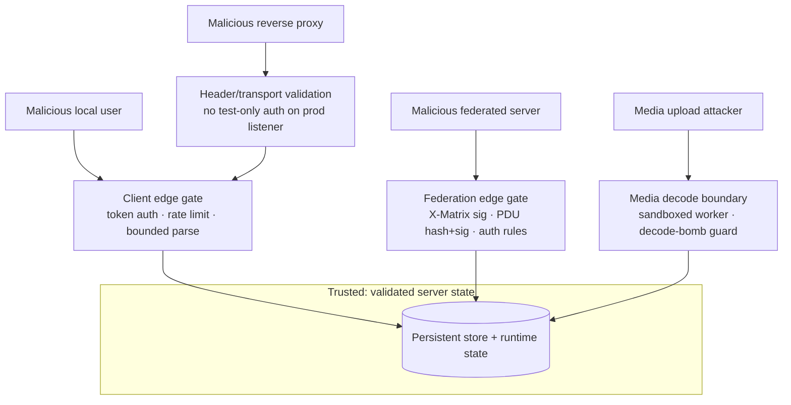

# Threat Model

## Initial attacker categories

- Malicious local users
- Malicious federated homeservers
- Remote resource exhaustion attackers
- Database exfiltration attackers
- Media upload attackers
- Malicious reverse proxies
- Supply-chain attackers
- Compromised administrators

## High-risk surfaces

- Federation transaction parsing
- Canonical JSON
- Event authorization
- State resolution
- Device and key APIs
- E2EE /keys/upload signature validation (verifies one-time and fallback key signatures against the device's own identity key, rejecting unverifiable keys with 400 M_INVALID_SIGNATURE)
- Token handling
- Server signing-key persistence
- Media handling
- Image decoding (thumbnail generation; isolated in a sandboxed worker)
- Outbound requests (SSRF via federation discovery and remote media fetch)
- Config parsing
- Database migrations

## Trust boundaries

Each attacker class reaches the server through a specific boundary. The gate at
that boundary must run, fail-closed, before any state is touched.

| Attacker | Primary surface | Key mitigation |
|---|---|---|
| Malicious local user | Client-server API | Access-token auth, login-enumeration-resistant errors, rate limits, bounded parsers |
| Malicious federated server | Federation transactions | X-Matrix verification, per-PDU content-hash + sender-domain Ed25519 checks, auth rules before persist, EDU origin-ownership checks |
| Remote exhaustion attacker | Listeners, queues, parsers | Bounded queues, rate limiting, resource limits, circuit breakers |
| Media upload attacker | Image decoding | Out-of-process seccomp/rlimit-sandboxed worker, pixel-count decode-bomb guard, MIME sniffing, quarantine |
| Malicious reverse proxy | Header/transport trust | Production listener rejects test-only credential encodings; response header validation |
| DB exfiltration attacker | Persistence | Prepared statements only, runtime/migration role separation, audit redaction; at-rest encryption for the server signing secret when a master key is configured; Argon2id hashing for registration tokens |
| Supply-chain attacker | Dependencies, release | Vendored/pinned subprojects, secret scanning, SBOM; signing/provenance tracked in production milestone |
| Compromised administrator | Admin surface | Audited admin actions; richer admin authZ tracked as a gap |

## Mitigations applied

Specific issues found and fixed, in the order they landed. Each entry names the
threat it closes; the controls above are the standing defences these reinforce.

- **Production federation-listener auth confusion:** the production federation
  listener previously accepted a pipe-delimited fixture token format in
  addition to real `X-Matrix` authorization headers. A request path that is
  reachable from production traffic must not share test-only credential
  encodings. Fixed by accepting only `Authorization: X-Matrix ...` on
  `handle_federation_http_request()`.

- **Login enumeration and unkeyed token-hash leakage:** unknown users and bad
  passwords returned distinct external login errors, and bearer tokens were
  stored as unkeyed `token-hash:v2` digests. Fixed by always performing a
  password-verification step, collapsing external failures to `invalid login`,
  and issuing keyed `token-hash:v3` digests while retaining v2 lookup
  compatibility for existing persisted rows.

- **Registration validation-session memory growth:** repeated
  `/register/*/requestToken` calls could allocate unbounded validation-session
  entries. Fixed by pruning stale sessions and enforcing per-remote/global
  caps before allocating a new session.

- **Inbound EDU spoofing and parser ambiguity:** receipt, presence, and
  device-list EDUs were interpreted with ad hoc string scanning, allowing
  mismatched origin/user ownership checks to be skipped and spec-shaped receipt
  `event_ids` arrays to be misread. Fixed by parsing canonical JSON objects and
  rejecting `user_id`s whose server name does not match the sending origin.

- **Response-header injection through runtime metadata:** response headers were
  appended without shared validation. Fixed by validating header names/values
  before storing or formatting them and by emitting `X-Content-Type-Options:
  nosniff` on every response.

- **Relayed PDU signature bypass (C1):** `authorize_federation_pdu` previously skipped
  Ed25519 verification for PDUs whose sender domain differed from the transport origin
  (i.e., relayed PDUs). A malicious relay could persist events attributed to any user on
  any server. Fixed by resolving the sender domain's signing key via `remote_key_resolver`
  before authorizing; fail-closed when the resolver is wired but cannot produce a key.

- **Missing event-auth before persist (C2):** The production `pdu_sink` persisted inbound
  PDUs without calling `authorize_event_against_auth_events`. A federated peer could
  persist events that violate the room's power-level and membership rules. Fixed by running
  full event-authorization against the room's current resolved state before persistence.

- **Server signing secret stored plaintext at rest:** the Ed25519 server signing
  secret seed was persisted as a base64 plaintext value in the database, so a DB
  exfiltration attacker could forge federation signatures and impersonate the
  server. Fixed by encrypting the seed with `secret_box` under a domain-separated
  XSalsa20-Poly1305 key derived from `security.secrets.master_key_file`; a
  transparent plaintext fallback remains for deployments that have not yet
  provisioned a master key, with a one-time diagnostic so operators can rotate
  to encrypted storage.

- **Registration token stored and compared as plaintext:** the shared
  registration token was loaded from config and compared with `sodium_memcmp`,
  leaving the token in long-term process memory and exposing a timing side-channel.
  Fixed by hashing the token with Argon2id (`crypto_pwhash_str`) and verifying
  with `crypto_pwhash_str_verify`; only the hash is retained, and the plaintext
  token is zeroised after hashing.

- **Untrusted image decoding in-process:** generating thumbnails requires
  decoding attacker-supplied PNG/JPEG bytes, and the C image parsers
  (libpng/libjpeg-turbo) are a historic memory-corruption surface. Decoding now
  happens in a short-lived, sandboxed `merovingian-thumbnail-worker` child
  process that — before reading any input — clamps its address space, CPU time,
  output size, and descriptor count via `setrlimit`, sets
  `PR_SET_NO_NEW_PRIVS`, disables core dumps, and installs the seccomp-bpf
  filter. The worker holds no secrets, sockets, or filesystem access beyond its
  stdio pipes, so a decoder exploit is contained. The parent enforces a
  wall-clock timeout, input/output size caps, and a pixel-count decode-bomb
  guard, and SIGKILLs a worker that overruns. See `media/thumbnailer.hpp` and
  [media-repository.md](media-repository.md).

## Security principles

- Fail closed.
- Bound all resources.
- Treat all external input as hostile.
- Preserve Matrix server-blind E2EE.
- Separate privileges where practical.
- Prefer simple auditable code.
