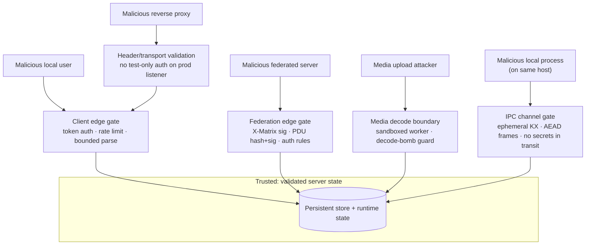

# Threat Model

## Initial attacker categories

- Malicious local users
- Malicious federated homeservers
- Remote resource exhaustion attackers
- Database exfiltration attackers
- Media upload attackers
- Malicious reverse proxies
- Supply-chain attackers
- Compromised administrators

## High-risk surfaces

- Federation transaction parsing
- Canonical JSON
- Event authorization
- State resolution
- Device and key APIs
- E2EE /keys/upload signature validation (verifies one-time and fallback key signatures against the device's own identity key, rejecting unverifiable keys with 400 M_INVALID_SIGNATURE)
- Token handling
- Server signing-key persistence
- Media handling
- Image decoding (thumbnail generation; isolated in a sandboxed worker)
- Outbound requests (SSRF via federation discovery and remote media fetch)
- Config parsing
- Database migrations

## Trust boundaries

Each attacker class reaches the server through a specific boundary. The gate at
that boundary must run, fail-closed, before any state is touched.

| Attacker | Primary surface | Key mitigation |
|---|---|---|
| Malicious local user | Client-server API | Access-token auth, login-enumeration-resistant errors, rate limits, bounded parsers |
| Malicious federated server | Federation transactions | X-Matrix verification, per-PDU content-hash + sender-domain Ed25519 checks, auth rules before persist, EDU origin-ownership checks |
| Remote exhaustion attacker | Listeners, queues, parsers | Bounded queues, rate limiting, resource limits, circuit breakers |
| Media upload attacker | Image decoding | Out-of-process seccomp/rlimit-sandboxed worker, pixel-count decode-bomb guard, MIME sniffing, quarantine |
| Malicious reverse proxy | Header/transport trust | Production listener rejects test-only credential encodings; response header validation |
| Malicious local process | IPC channel sniffing | Ephemeral `crypto_kx` + AEAD encryption; no filesystem socket path; signing key never loaded in worker and never forwarded over IPC; access tokens stripped |
| DB exfiltration attacker | Persistence | Prepared statements only, runtime/migration role separation, audit redaction; at-rest encryption for the server signing secret when a master key is configured; Argon2id hashing for registration tokens |
| Supply-chain attacker | Dependencies, release | Vendored/pinned subprojects, secret scanning, SBOM; signing/provenance tracked in production milestone |
| Compromised administrator | Admin surface | Audited admin actions; richer admin authZ tracked as a gap |

## Mitigations applied

Specific issues found and fixed, in the order they landed. Each entry names the
threat it closes; the controls above are the standing defences these reinforce.

- **Production federation-listener auth confusion:** the production federation
  listener previously accepted a pipe-delimited fixture token format in
  addition to real `X-Matrix` authorization headers. A request path that is
  reachable from production traffic must not share test-only credential
  encodings. Fixed by accepting only `Authorization: X-Matrix ...` on
  `handle_federation_http_request()`.

- **Login enumeration and unkeyed token-hash leakage:** unknown users and bad
  passwords returned distinct external login errors, and bearer tokens were
  stored as unkeyed `token-hash:v2` digests. Fixed by always performing a
  password-verification step, collapsing external failures to `invalid login`,
  and issuing keyed `token-hash:v3` digests while retaining v2 lookup
  compatibility for existing persisted rows.

- **Registration validation-session memory growth:** repeated
  `/register/*/requestToken` calls could allocate unbounded validation-session
  entries. Fixed by pruning stale sessions and enforcing per-remote/global
  caps before allocating a new session.

- **Inbound EDU spoofing and parser ambiguity:** receipt, presence, and
  device-list EDUs were interpreted with ad hoc string scanning, allowing
  mismatched origin/user ownership checks to be skipped and spec-shaped receipt
  `event_ids` arrays to be misread. Fixed by parsing canonical JSON objects and
  rejecting `user_id`s whose server name does not match the sending origin.

- **Response-header injection through runtime metadata:** response headers were
  appended without shared validation. Fixed by validating header names/values
  before storing or formatting them and by emitting `X-Content-Type-Options:
  nosniff` on every response.

- **Relayed PDU signature bypass (C1):** `authorize_federation_pdu` previously skipped
  Ed25519 verification for PDUs whose sender domain differed from the transport origin
  (i.e., relayed PDUs). A malicious relay could persist events attributed to any user on
  any server. Fixed by resolving the sender domain's signing key via `remote_key_resolver`
  before authorizing; fail-closed when the resolver is wired but cannot produce a key.

- **Thumbnail worker descriptor leak + privilege-escalation surface:** the parent forked the
  image decoder with `pipe()` (descriptor leak) and did not close other inherited descriptors
  or set `PR_SET_NO_NEW_PRIVS` before `execv()`. A compromised worker could access unrelated
  parent sockets/files or escalate via a setuid helper. Fixed by creating pipes with `O_CLOEXEC`,
  sweeping all non-stdio descriptors in the child, and setting no-new-privs before exec.

- **Missing event-auth before persist (C2):** The production `pdu_sink` persisted inbound
  PDUs without calling `authorize_event_against_auth_events`. A federated peer could
  persist events that violate the room's power-level and membership rules. Fixed by running
  full event-authorization against the room's current resolved state before persistence.

- **Server signing secret stored plaintext at rest:** the Ed25519 server signing
  secret seed was persisted as a base64 plaintext value in the database, so a DB
  exfiltration attacker could forge federation signatures and impersonate the
  server. Fixed by encrypting the seed with `secret_box` under a domain-separated
  XSalsa20-Poly1305 key derived from `security.secrets.master_key_file`; a
  transparent plaintext fallback remains for deployments that have not yet
  provisioned a master key, with a one-time diagnostic so operators can rotate
  to encrypted storage.

- **Registration token stored and compared as plaintext:** the shared
  registration token was loaded from config and compared with `sodium_memcmp`,
  leaving the token in long-term process memory and exposing a timing side-channel.
  Fixed by hashing the token with Argon2id (`crypto_pwhash_str`) and verifying
  with `crypto_pwhash_str_verify`; only the hash is retained, and the plaintext
  token is zeroised after hashing.

- **Untrusted image decoding in-process:** generating thumbnails requires
  decoding attacker-supplied PNG/JPEG bytes, and the C image parsers
  (libpng/libjpeg-turbo) are a historic memory-corruption surface. Decoding now
  happens in a short-lived, sandboxed `merovingian-thumbnail-worker` child
  process that — before reading any input — clamps its address space, CPU time,
  output size, and descriptor count via `setrlimit`, sets
  `PR_SET_NO_NEW_PRIVS`, disables core dumps, and installs the seccomp-bpf
  filter. The worker holds no secrets, sockets, or filesystem access beyond its
  stdio pipes, so a decoder exploit is contained. The parent enforces a
  wall-clock timeout, input/output size caps, and a pixel-count decode-bomb
  guard, and SIGKILLs a worker that overruns. See `media/thumbnailer.hpp` and
  [media-repository.md](media-repository.md).

- **Variable-length secret comparison leaking length (#8):** comparing a config
  secret with a fixed-size function such as `sodium_memcmp` up to the shorter
  length branches on the secret's size before comparing bytes. Fixed by adding a
  domain-separated `crypto_generichash` path that produces fixed-size digests for
  both inputs and compares those digests with `sodium_memcmp`, hiding length
  differences.

- **Runtime hardening controls not applied in-process (#9):** the startup
  hardening self-check documented `core dump policy`, `no_new_privs`, and
  `capability bounding` as alpha exceptions without enforcing them. On Linux the
  server now clamps `RLIMIT_CORE` to zero, sets `PR_SET_NO_NEW_PRIVS`, and drops
  the capability bounding set before serving traffic; the self-check reports the
  resulting status instead of a placeholder.

- **Signing secret material in ordinary process memory (#10):** the Ed25519 server
  signing secret was kept in a plain `std::vector` while loaded for signing and
  token-key derivation, leaving it exposed to swap and core dumps and copying it
  into regular containers. Fixed by storing the secret in `core::SecretBuffer`,
  which uses libsodium `mlock` and zeroises the buffer on destruction or move.

- **Seccomp filter architecture guard was x86_64-only (#11):** the seccomp-bpf
  architecture check hard-coded `AUDIT_ARCH_X86_64`, so an aarch64 build would
  either mismatch the filter or silently accept a wrong constant. Fixed by
  selecting `AUDIT_ARCH_X86_64` or `AUDIT_ARCH_AARCH64` at compile time and
  returning `SECCOMP_RET_KILL_PROCESS` on any unsupported architecture.

- **RELRO/BIND_NOW not explicit in linker flags (#12):** the build and packaging
  scripts relied on toolchain defaults for partial RELRO and lazy binding,
  leaving GOT/PLT writable at runtime. `-Wl,-z,relro` and `-Wl,-z,now` are now
  passed explicitly in `meson.build` and every packaging script, and the startup
  ELF probe verifies `PT_GNU_RELRO` and `DT_BIND_NOW`.

- **Relayed-PDU fail-open with no sender-domain key (#270):** the prior (C1)
  mitigation only fail-closed when `remote_key_resolver` was wired but returned
  no key. On a receive-only/locked-down deployment where the resolver is never
  wired (because `local_http_router.cpp` gates wiring on `outbound && discovery`),
  `authorize_federation_pdu` fell through to accept the PDU with no cryptographic
  check, so a known peer could forge events attributed to another server. Fixed
  by returning `403 "sender domain signing key unavailable"` whenever the
  sender-domain key is missing or mismatched, and removing the test-only
  two-arg overload that passed `std::nullopt` so no path can exercise fail-open.

- **Account lock/suspend did not gate already-issued tokens (#271):** suspending
  or locking a user had no effect on access tokens already issued, so a
  moderated user retained full API access until token expiry. Fixed per spec
  v1.18 by gating the request path rather than revoking sessions: locked
  accounts get `M_USER_LOCKED` (`soft_logout:true`) on all endpoints except
  `/logout` and `/logout/all`, and suspended accounts get `M_USER_SUSPENDED`
  on actions outside the spec allowlist. New admin endpoints
  `/_matrix/client/v1/admin/lock/{userId}` and `/_matrix/client/v1/admin/suspend/{userId}`
  set the state with anti-enumeration ordering (admin auth before any target
  lookup), locality, and self/other-admin guards. No proactive token revocation,
  conforming to spec.

- **Password change left other devices' tokens valid (#272):** `POST /account/password`
  ignored `logout_devices` (spec default `true`), so a token stolen from another
  device stayed valid after the victim changed their password. Fixed by reading
  `logout_devices` (default `true`) and revoking every other device's
  access/refresh tokens and in-memory sessions while preserving the caller's
  device; device records are retained.

- **Power-levels sender self-elevation (#273):** the elevation guard in
  `events/authorization.cpp` exempted the sender (`if (user_entry.key != *sender)`),
  letting a moderator raise their own power above their current level in a single
  event and seize admin. Fixed by removing the exemption so spec rule 9.9 applies
  to the sender's own entry.

- **Power-levels removal/demotion of a superior user unchecked (#274):** the
  users-map loop iterated only the incoming `content.users`, so omitting a
  superior user was never checked (they silently fell to `users_default`), and
  the demotion guard used `>` instead of spec's `>=`. Fixed by iterating the
  union of old and new `users` keys and rejecting any change or removal of a
  user at or above the sender's power (spec rule 9.8), excluding the sender's
  own entry from the demotion check.

- **Registration-token validity endpoint compared plaintext (#266):**
  `GET /_matrix/client/v1/register/m.login.registration_token/validity` compared
  the configured registration token as plaintext, bypassing the Argon2id
  hashed-token comparator already used by `/register` and leaving token
  material on the request path. Fixed by loading the hashed token via
  `load_hashed_registration_token` and verifying the candidate with
  `registration_token_matches` (`crypto_pwhash_str_verify`); only the hash is
  consulted.

- **Media SSRF filter diverged from the federation single source of truth
  (#267):** `media::address_is_private_or_loopback` was a weak string-prefix
  duplicate of the robust `inet_pton`-based
  `federation::ip_address_is_private_or_loopback`, so remote-media fetch
  blocking could drift from the federation path. Fixed by delegating the media
  helper to the federation helper, eliminating the duplicate SSRF filter and
  its divergent edge cases.

- **Token-hash lookups compared with `==` (#268):** five fixed-length token-hash
  comparisons (access/refresh store lookups and the in-memory session match)
  used `==`, a timing side-channel on secret bytes. Fixed by routing every
  fixed-length hash match through `crypto::constant_time_equal` /
  `auth::constant_time_equal` (`sodium_memcmp`), per the crypto-boundary rule.

- **`172.` string fallback over- and under-blocked private ranges (#269):** the
  string-prefix fallback's `172.` clause (`address[4] >= '1' && address[4] <= '3'`)
  over-blocked public `172.1`–`172.3` and under-blocked the rest of `172.16/12`.
  Fixed by removing the clause; the `172.16/12` range is handled correctly by
  the `inet_pton` numeric path, and the remaining hostname prefixes stay for
  fail-safe handling of non-IP inputs.

- **Access/refresh tokens never expired server-side (#275):** tokens remained
  valid indefinitely despite the advertised 1-hour TTL, so a leaked token was
  usable forever and the advertised lifetime was unenforced. Fixed by adding an
  `expires_at` field to `PersistentAccessToken`, `PersistentRefreshToken`, and
  `LocalSession`, set at issuance from configurable
  `security.access_token_lifetime_ms` (default 1h) and
  `security.refresh_token_lifetime_ms` (default 30d); `find_session` and the
  refresh-token lookup reject expired tokens (audit reason `token expired`),
  forcing re-login/refresh. The advertised `expires_in_ms` now reads from the
  configured access-token lifetime so advertised == enforced.

- **`SecretBuffer` wipe was elidable and moves left residue (#276):** the
  destructor used `std::ranges::fill(m_buffer, 0U)`, a dead store the compiler
  can elide, and default moves did not wipe, so signing-key residue was not
  reliably cleared and could survive in moved-from objects. Fixed by
  `sodium_mlock`-ing on construction and `sodium_munlock`-ing (which zeroises
  and unpins, an optimisation barrier) on destruction, with custom move-ctor /
  move-assign that transfer the mlock to the destination and wipe the source.

- **Federation work starving client threads (out-of-process worker, v0.10.1):**
  joining a large room via federation saturated the main thread pool with PDU
  verification, state resolution, and membership work, making all connected
  clients unresponsive. The attack surface is the IPC channel between the main
  process and the new `merovingian-fed-worker` child. Mitigations: (a) the
  channel uses an ephemeral `crypto_kx` key exchange and
  `crypto_secretstream_xchacha20poly1305` AEAD so a local process that can
  read the socket pair sees only ciphertext; (b) client access tokens are
  stripped before serialisation so the worker receives only the validated
  context it needs; (c) the channel uses an `AF_UNIX` socket pair inherited at
  spawn with `SOCK_CLOEXEC` and no filesystem path, removing the impersonation
  surface; (d) PDU writes to the persistent store remain exclusively in the main
  process so stream-ordering integrity is preserved.

- **Signing secret in federation worker address space (v0.10.2):**
  in Phase 1 the worker loaded the server signing secret from the database, so a
  compromised worker could forge federation signatures. Phase 2 removes the
  secret from the worker entirely: the worker delegates signing to the main
  process over the existing encrypted IPC channel via `sign_request` /
  `sign_response` frames, and `IpcEd25519Provider::verify` is unsupported in
  the worker. The private key exists only in the main process's locked
  `SecretBuffer`; worker compromise now leaks no long-lived signing material.

- **Single worker as a chokepoint (v0.10.3, mitigated in v0.10.4):**
  Phase 1 used one federation worker for every room. A CPU-heavy room could
  still delay federation traffic for all other rooms because that single process
  had to process every inbound PDU. Phase 3 shards rooms across N independent
  `merovingian-fed-worker` processes using `fnv1a_32(room_id) % shards`;
  non-room requests route to shard 0. A crash or resource exhaustion in one
  shard only affects the rooms owned by that shard. As of v0.10.4 the
  out-of-process worker is mandatory and there is no `fallback_in_process`
  option; federation is always isolated and fails closed if the worker cannot
  be launched. The `WorkerSupervisor` restarts crashed workers automatically
  with exponential back-off.

## Security principles

- Fail closed.
- Bound all resources.
- Treat all external input as hostile.
- Preserve Matrix server-blind E2EE.
- Separate privileges where practical.
- Prefer simple auditable code.
