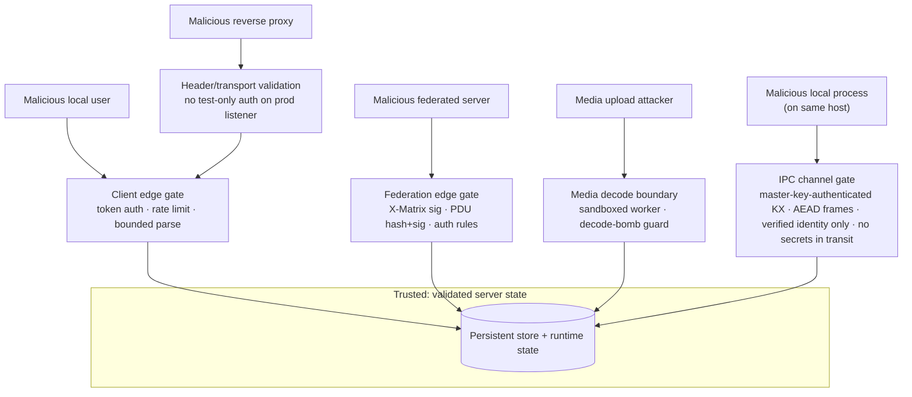

# Threat Model

## Initial attacker categories

- Malicious local users
- Malicious federated homeservers
- Remote resource exhaustion attackers
- Database exfiltration attackers
- Media upload attackers
- Malicious reverse proxies
- Supply-chain attackers
- Compromised administrators

## High-risk surfaces

- Federation transaction parsing
- Per-room server ACL enforcement (`m.room.server_acl`)
- Canonical JSON
- Event authorization
- State resolution
- Device and key APIs
- E2EE /keys/upload signature validation (verifies one-time and fallback key signatures against the device's own identity key, rejecting unverifiable keys with 400 M_INVALID_SIGNATURE)
- Token handling
- Server signing-key persistence
- Media handling
- Image decoding (thumbnail generation; isolated in a sandboxed worker)
- Outbound requests (SSRF via federation discovery and remote media fetch)
- Config parsing
- Database migrations

## Trust boundaries

Each attacker class reaches the server through a specific boundary. The gate at
that boundary must run, fail-closed, before any state is touched.

```mermaid
flowchart TB
    localuser["Malicious local user"]
    peer["Malicious federated server"]
    proxy["Malicious reverse proxy"]
    uploader["Media upload attacker"]
    localproc["Malicious local process<br/>(on same host)"]

    subgraph trusted["Trusted: validated server state"]
        state[("Persistent store + runtime state")]
    end

    clientgate["Client edge gate<br/>token auth · rate limit · bounded parse"]
    fedgate["Federation edge gate<br/>X-Matrix sig · PDU hash+sig · auth rules"]
    headergate["Header/transport validation<br/>no test-only auth on prod listener"]
    mediagate["Media decode boundary<br/>sandboxed worker · decode-bomb guard"]
    ipcgate["IPC channel gate<br/>master-key-authenticated KX · AEAD frames · verified identity only · no secrets in transit"]

    localuser --> clientgate --> state
    peer --> fedgate --> state
    proxy --> headergate --> clientgate
    uploader --> mediagate --> state
    localproc --> ipcgate --> state
```

| Attacker | Primary surface | Key mitigation |
|---|---|---|
| Malicious local user | Client-server API | Access-token auth, login-enumeration-resistant errors, rate limits, bounded parsers |
| Malicious federated server | Federation transactions | X-Matrix verification, per-PDU content-hash + sender-domain Ed25519 checks, auth rules before persist, EDU origin-ownership checks, and per-room `m.room.server_acl` enforcement on protected endpoints and inbound PDUs/EDUs |
| Remote exhaustion attacker | Listeners, queues, parsers | Bounded queues, rate limiting, resource limits, circuit breakers |
| Media upload attacker | Image decoding | Out-of-process seccomp/rlimit-sandboxed worker, pixel-count decode-bomb guard, MIME sniffing, quarantine |
| Malicious reverse proxy | Header/transport trust | Production listener rejects test-only credential encodings; response header validation; public listeners require TLS and cannot declare a local reverse proxy, while loopback cleartext requires an explicit `reverse_proxy=true` declaration |
| Malicious local process | IPC channel sniffing | Master-key-authenticated `crypto_kx` handshake (#318) + AEAD encryption; no filesystem socket path; signing key never loaded in worker and never forwarded over IPC (#317); main verifies inbound X-Matrix signatures and forwards only the verified peer identity — the raw peer `access_token`/`Authorization` never crosses IPC (#323) |
| DB exfiltration attacker | Persistence | Prepared statements only, runtime/migration role separation, audit redaction; at-rest encryption for the server signing secret when a master key is configured; Argon2id hashing for registration tokens |
| Supply-chain attacker | Dependencies, release | Vendored/pinned subprojects, secret scanning, SBOM; signing/provenance tracked in production milestone |
| Compromised administrator | Admin surface | Audited admin actions; richer admin authZ tracked as a gap |

## Mitigations applied

Specific issues found and fixed, in the order they landed. Each entry names the
threat it closes; the controls above are the standing defences these reinforce.

- **Production federation-listener auth confusion:** the production federation
  listener previously accepted a pipe-delimited fixture token format in
  addition to real `X-Matrix` authorization headers. A request path that is
  reachable from production traffic must not share test-only credential
  encodings. Fixed by accepting only `Authorization: X-Matrix ...` on
  `handle_federation_http_request()`.

- **Login enumeration and unkeyed token-hash leakage:** unknown users and bad
  passwords returned distinct external login errors, and bearer tokens were
  stored as unkeyed `token-hash:v2` digests. Fixed by always performing a
  password-verification step, collapsing external failures to `invalid login`,
  and issuing keyed `token-hash:v3` digests while retaining v2 lookup
  compatibility for existing persisted rows.

- **Registration validation-session memory growth:** repeated
  `/register/*/requestToken` calls could allocate unbounded validation-session
  entries. Fixed by pruning stale sessions and enforcing per-remote/global
  caps before allocating a new session.

- **Inbound EDU spoofing and parser ambiguity:** receipt, presence, and
  device-list EDUs were interpreted with ad hoc string scanning, allowing
  mismatched origin/user ownership checks to be skipped and spec-shaped receipt
  `event_ids` arrays to be misread. Fixed by parsing canonical JSON objects and
  rejecting `user_id`s whose server name does not match the sending origin.

- **Response-header injection through runtime metadata:** response headers were
  appended without shared validation. Fixed by validating header names/values
  before storing or formatting them and by emitting `X-Content-Type-Options:
  nosniff` on every response.

- **Relayed PDU signature bypass (C1):** `authorize_federation_pdu` previously skipped
  Ed25519 verification for PDUs whose sender domain differed from the transport origin
  (i.e., relayed PDUs). A malicious relay could persist events attributed to any user on
  any server. Fixed by resolving the sender domain's signing key via `remote_key_resolver`
  before authorizing; fail-closed when the resolver is wired but cannot produce a key.

- **Thumbnail worker descriptor leak + privilege-escalation surface:** the parent forked the
  image decoder with `pipe()` (descriptor leak) and did not close other inherited descriptors
  or set `PR_SET_NO_NEW_PRIVS` before `execv()`. A compromised worker could access unrelated
  parent sockets/files or escalate via a setuid helper. Fixed by creating pipes with `O_CLOEXEC`,
  sweeping all non-stdio descriptors in the child, and setting no-new-privs before exec.

- **Missing event-auth before persist (C2):** The production `pdu_sink` persisted inbound
  PDUs without calling `authorize_event_against_auth_events`. A federated peer could
  persist events that violate the room's power-level and membership rules. Fixed by running
  full event-authorization against the room's current resolved state before persistence.

- **Server signing secret stored plaintext at rest:** the Ed25519 server signing
  secret seed was persisted as a base64 plaintext value in the database, so a DB
  exfiltration attacker could forge federation signatures and impersonate the
  server. Fixed by encrypting the seed with `secret_box` under a domain-separated
  XSalsa20-Poly1305 key derived from `security.secrets.master_key_file`; a
  transparent plaintext fallback remains for deployments that have not yet
  provisioned a master key, with a one-time diagnostic so operators can rotate
  to encrypted storage.

- **Registration token stored and compared as plaintext:** the shared
  registration token was loaded from config and compared with `sodium_memcmp`,
  leaving the token in long-term process memory and exposing a timing side-channel.
  Fixed by hashing the token with Argon2id (`crypto_pwhash_str`) and verifying
  with `crypto_pwhash_str_verify`; only the hash is retained, and the plaintext
  token is zeroised after hashing.

- **Untrusted image decoding in-process:** generating thumbnails requires
  decoding attacker-supplied PNG/JPEG bytes, and the C image parsers
  (libpng/libjpeg-turbo) are a historic memory-corruption surface. Decoding now
  happens in a short-lived, sandboxed `merovingian-thumbnail-worker` child
  process that — before reading any input — clamps its address space, CPU time,
  output size, and descriptor count via `setrlimit`, sets
  `PR_SET_NO_NEW_PRIVS`, disables core dumps, and installs the seccomp-bpf
  filter. The worker holds no secrets, sockets, or filesystem access beyond its
  stdio pipes, so a decoder exploit is contained. The parent enforces a
  wall-clock timeout, input/output size caps, and a pixel-count decode-bomb
  guard, and SIGKILLs a worker that overruns. See `media/thumbnailer.hpp` and
  [media-repository.md](media-repository.md).

- **Variable-length secret comparison leaking length (#8):** comparing a config
  secret with a fixed-size function such as `sodium_memcmp` up to the shorter
  length branches on the secret's size before comparing bytes. Fixed by adding a
  domain-separated `crypto_generichash` path that produces fixed-size digests for
  both inputs and compares those digests with `sodium_memcmp`, hiding length
  differences.

- **Runtime hardening controls not applied in-process (#9):** the startup
  hardening self-check documented `core dump policy`, `no_new_privs`, and
  `capability bounding` as alpha exceptions without enforcing them. On Linux the
  server now clamps `RLIMIT_CORE` to zero, sets `PR_SET_NO_NEW_PRIVS`, and drops
  the capability bounding set before serving traffic; the self-check reports the
  resulting status instead of a placeholder.

- **Signing secret material in ordinary process memory (#10):** the Ed25519 server
  signing secret was kept in a plain `std::vector` while loaded for signing and
  token-key derivation, leaving it exposed to swap and core dumps and copying it
  into regular containers. Fixed by storing the secret in `core::SecretBuffer`,
  which uses libsodium `mlock` and zeroises the buffer on destruction or move.

- **Seccomp filter architecture guard was x86_64-only (#11):** the seccomp-bpf
  architecture check hard-coded `AUDIT_ARCH_X86_64`, so an aarch64 build would
  either mismatch the filter or silently accept a wrong constant. Fixed by
  selecting `AUDIT_ARCH_X86_64` or `AUDIT_ARCH_AARCH64` at compile time and
  returning `SECCOMP_RET_KILL_PROCESS` on any unsupported architecture.

- **RELRO/BIND_NOW not explicit in linker flags (#12):** the build and packaging
  scripts relied on toolchain defaults for partial RELRO and lazy binding,
  leaving GOT/PLT writable at runtime. `-Wl,-z,relro` and `-Wl,-z,now` are now
  passed explicitly in `meson.build` and every packaging script, and the startup
  ELF probe verifies `PT_GNU_RELRO` and `DT_BIND_NOW`.

- **Relayed-PDU fail-open with no sender-domain key (#270):** the prior (C1)
  mitigation only fail-closed when `remote_key_resolver` was wired but returned
  no key. On a receive-only/locked-down deployment where the resolver is never
  wired (because `local_http_router.cpp` gates wiring on `outbound && discovery`),
  `authorize_federation_pdu` fell through to accept the PDU with no cryptographic
  check, so a known peer could forge events attributed to another server. Fixed
  by returning `403 "sender domain signing key unavailable"` whenever the
  sender-domain key is missing or mismatched, and removing the test-only
  two-arg overload that passed `std::nullopt` so no path can exercise fail-open.

- **Account lock/suspend did not gate already-issued tokens (#271):** suspending
  or locking a user had no effect on access tokens already issued, so a
  moderated user retained full API access until token expiry. Fixed per spec
  v1.19 by gating the request path rather than revoking sessions: locked
  accounts get `M_USER_LOCKED` (`soft_logout:true`) on all endpoints except
  `/logout` and `/logout/all`, and suspended accounts get `M_USER_SUSPENDED`
  on actions outside the spec allowlist. New admin endpoints
  `/_matrix/client/v1/admin/lock/{userId}` and `/_matrix/client/v1/admin/suspend/{userId}`
  set the state with anti-enumeration ordering (admin auth before any target
  lookup), locality, and self/other-admin guards. No proactive token revocation,
  conforming to spec.

- **Password change left other devices' tokens valid (#272):** `POST /account/password`
  ignored `logout_devices` (spec default `true`), so a token stolen from another
  device stayed valid after the victim changed their password. Fixed by reading
  `logout_devices` (default `true`) and revoking every other device's
  access/refresh tokens and in-memory sessions while preserving the caller's
  device; device records are retained.

- **Power-levels sender self-elevation (#273):** the elevation guard in
  `events/authorization.cpp` exempted the sender (`if (user_entry.key != *sender)`),
  letting a moderator raise their own power above their current level in a single
  event and seize admin. Fixed by removing the exemption so spec rule 9.9 applies
  to the sender's own entry.

- **Power-levels removal/demotion of a superior user unchecked (#274):** the
  users-map loop iterated only the incoming `content.users`, so omitting a
  superior user was never checked (they silently fell to `users_default`), and
  the demotion guard used `>` instead of spec's `>=`. Fixed by iterating the
  union of old and new `users` keys and rejecting any change or removal of a
  user at or above the sender's power (spec rule 9.8), excluding the sender's
  own entry from the demotion check.

- **Registration-token validity endpoint compared plaintext (#266):**
  `GET /_matrix/client/v1/register/m.login.registration_token/validity` compared
  the configured registration token as plaintext, bypassing the Argon2id
  hashed-token comparator already used by `/register` and leaving token
  material on the request path. Fixed by loading the hashed token via
  `load_hashed_registration_token` and verifying the candidate with
  `registration_token_matches` (`crypto_pwhash_str_verify`); only the hash is
  consulted.

- **Media SSRF filter diverged from the federation single source of truth
  (#267):** `media::address_is_private_or_loopback` was a weak string-prefix
  duplicate of the robust `inet_pton`-based
  `federation::ip_address_is_private_or_loopback`, so remote-media fetch
  blocking could drift from the federation path. Fixed by delegating the media
  helper to the federation helper, eliminating the duplicate SSRF filter and
  its divergent edge cases.

- **Token-hash lookups compared with `==` (#268):** five fixed-length token-hash
  comparisons (access/refresh store lookups and the in-memory session match)
  used `==`, a timing side-channel on secret bytes. Fixed by routing every
  fixed-length hash match through `crypto::constant_time_equal` /
  `auth::constant_time_equal` (`sodium_memcmp`), per the crypto-boundary rule.

- **`172.` string fallback over- and under-blocked private ranges (#269):** the
  string-prefix fallback's `172.` clause (`address[4] >= '1' && address[4] <= '3'`)
  over-blocked public `172.1`–`172.3` and under-blocked the rest of `172.16/12`.
  Fixed by removing the clause; the `172.16/12` range is handled correctly by
  the `inet_pton` numeric path, and the remaining hostname prefixes stay for
  fail-safe handling of non-IP inputs.

- **Access/refresh tokens never expired server-side (#275):** tokens remained
  valid indefinitely despite the advertised 1-hour TTL, so a leaked token was
  usable forever and the advertised lifetime was unenforced. Fixed by adding an
  `expires_at` field to `PersistentAccessToken`, `PersistentRefreshToken`, and
  `LocalSession`, set at issuance from configurable
  `security.access_token_lifetime_ms` (default 1h) and
  `security.refresh_token_lifetime_ms` (default 30d); `find_session` and the
  refresh-token lookup reject expired tokens (audit reason `token expired`),
  forcing re-login/refresh. The advertised `expires_in_ms` now reads from the
  configured access-token lifetime so advertised == enforced.

- **`SecretBuffer` wipe was elidable and moves left residue (#276):** the
  destructor used `std::ranges::fill(m_buffer, 0U)`, a dead store the compiler
  can elide, and default moves did not wipe, so signing-key residue was not
  reliably cleared and could survive in moved-from objects. Fixed by
  `sodium_mlock`-ing on construction and `sodium_munlock`-ing (which zeroises
  and unpins, an optimisation barrier) on destruction, with custom move-ctor /
  move-assign that transfer the mlock to the destination and wipe the source.

- **Federation work starving client threads (out-of-process worker, v0.10.1):**
  joining a large room via federation saturated the main thread pool with PDU
  verification, state resolution, and membership work, making all connected
  clients unresponsive. The attack surface is the IPC channel between the main
  process and the new `merovingian-fed-worker` child. Mitigations: (a) the
  channel uses a **master-key-authenticated** `crypto_kx` key exchange (#318):
  both processes derive the same IPC auth key from the operator master-key file
  and MAC each other's ephemeral public keys before deriving session keys, so a
  local process that reaches the inherited fd without the master key cannot
  complete the handshake; frames are then `crypto_secretstream_xchacha20poly1305`
  AEAD-encrypted so a process that can read the socket pair sees only ciphertext;
  (b) the main process verifies the inbound X-Matrix signature itself and
  forwards only the verified peer identity (`origin`/`key_id`/`sig_verified`) —
  the raw peer `access_token` and `Authorization`/`X-Matrix` headers are stripped
  and never cross IPC (#323), so a compromised worker cannot harvest or replay
  peer homeserver credentials; (c) the channel uses an `AF_UNIX` socket pair
  inherited at spawn with `SOCK_CLOEXEC` and no filesystem path, removing the
  impersonation surface; (d) PDU writes to the persistent store remain
  exclusively in the main process so stream-ordering integrity is preserved.
  **Residual worker-trust model after #318/#319/#323:** the worker is trusted to
  act on the verified identity main forwards (it cannot forge peer credentials,
  and the signing secret never enters the worker per #317), but the outbound
  `Authorization` header the worker places on its own outbound HTTP requests is
  still pre-signed in main and carried across IPC — it is our own request-bound
  X-Matrix signature (bound to the method/url/body/destination of the exact
  request), not a reusable peer credential, so it carries no harvest/replay value.
  Relocating outbound signing into the worker via `IpcEd25519Provider` so the
  signed value never crosses IPC is deferred (requires a `build_outbound_request`
  provider-abstraction refactor) for minimal additional security value.

  **Main does not re-verify PDU Ed25519 signatures before persisting (#450,
  accepted residual gap):** main's `pdu_sink` (wired in
  `homeserver/local_http_router.cpp::ingest_pdu_event`, invoked directly for
  same-process federation and relayed from the worker via
  `homeserver/worker_pool.cpp`'s `pdu_ingest` IPC handler) runs
  `events::authorize_event_against_auth_events` and
  `events::verify_pdu_content_hash`, but does not independently re-run Ed25519
  signature verification against the sender's published key. The worker is the
  sole signature-verification boundary for the relay path
  (`federation::authorize_federation_pdu` with a resolver-fetched key, in
  `federation/inbound_request.cpp`, called before the transaction handler
  invokes `pdu_sink`). This is consistent with the residual worker-trust model
  above — the worker cannot forge a peer's identity and holds no signing
  secret — but it means main, which holds the signing secret and owns the
  authoritative store, trusts the worker's prior verification rather than
  checking cryptographically for itself. If the worker's `remote_key_resolver`
  is ever unwired, or a future bug relays before verifying, or the worker
  process is compromised, main would persist a forged PDU into the event
  graph. Accepted as a defense-in-depth gap rather than fixed with independent
  re-verification: doing so would require plumbing the raw PDU and a
  main-side-resolved remote key through to `ingest_pdu_event` (a different
  shape than the `InboundPduEnvelope` it receives today), which is a larger
  structural change than this gap's severity (LOW) warrants. Revisit if the
  worker's trust model changes (e.g. #319/#323-style hardening is ever
  weakened) or if `InboundPduEnvelope` gains a verified-signature carrier as
  part of unrelated work.

- **Signing secret in federation worker address space (v0.10.2):**
  in Phase 1 the worker loaded the server signing secret from the database, so a
  compromised worker could forge federation signatures. Phase 2 removes the
  secret from the worker entirely: the worker delegates signing to the main
  process over the existing encrypted IPC channel via `sign_request` /
  `sign_response` frames, and `IpcEd25519Provider::verify` is unsupported in
  the worker. The private key exists only in the main process's locked
  `SecretBuffer`; worker compromise now leaks no long-lived signing material.

- **Single worker as a chokepoint (v0.10.3, mitigated in v0.10.4):**
  Phase 1 used one federation worker for every room. A CPU-heavy room could
  still delay federation traffic for all other rooms because that single process
  had to process every inbound PDU. Phase 3 shards rooms across N independent
  `merovingian-fed-worker` processes using `fnv1a_32(room_id) % shards`;
  non-room requests route to shard 0. A crash or resource exhaustion in one
  shard only affects the rooms owned by that shard. As of v0.10.4 the
  out-of-process worker is mandatory and there is no `fallback_in_process`
  option; federation is always isolated and fails closed if the worker cannot
  be launched. The `WorkerSupervisor` restarts crashed workers automatically
  with exponential back-off.

- **Unbounded client-supplied `via` list drove unbounded thread spawning and
  unbounded join latency (v0.10.11):** `POST /join`'s `via`/`server_name` query
  parameters are attacker/client-controlled and were passed straight through to
  the parallel make_join race (v0.10.10) with no upper bound. Every candidate
  was spawned as an OS thread immediately via `std::launch::async` — only
  throttled to *run* by `join_parallelism`, not to *spawn* — so a client (or a
  room whose federation state legitimately spans dozens of servers) could
  make the server spin up one thread per via entry on every join attempt. The
  same unbounded candidate count meant the race had no upper bound on wall-clock
  time either: with `join_parallelism` concurrent slots and up to `join_timeout`
  per candidate, total race time scaled with candidate count and could run for
  many minutes — long after the calling client's own HTTP request (and any
  reverse proxy in front) had already timed out, so the client observed a
  generic fetch failure while the server kept working unseen. Fixed by two
  independent bounds: `security.federation.join_max_candidates` (default `20`)
  truncates the ordered candidate list to the first N entries *before* any
  `std::async` task is spawned, capping upfront thread creation regardless of
  `via` list size; `security.federation.join_race_deadline` (default `45s`)
  bounds the *entire* race's wall-clock time independent of the per-candidate
  `join_timeout`, so `join_room` always returns a definitive response within a
  bounded window. Candidates still in flight when either bound is hit are
  parked in the existing `orphan_futures_` background-drain queue, unchanged
  from the losing-candidate path.

- **`send_join` state and auth_chain events were persisted with no signature
  verification (v0.10.11):** `join_room`'s ingestion of a `send_join`
  response's `state` and `auth_chain` arrays parsed each event and wrote it
  straight to the persistent event graph, trusting the resident server's
  response wholesale — no Ed25519 signature check, no remote signing-key
  fetch, in direct violation of `src/federation/AGENTS.md` rule 2 ("Verify
  every inbound PDU's signature... Unverified events must be silently
  dropped"). A resident server (or an attacker able to act as one, e.g. via
  DNS/BGP hijack of a room's resident server) could inject arbitrary
  membership or state events into a joining server's view of the room with no
  cryptographic check. Fixed by `filter_verified_send_join_events`: distinct
  `(sender_domain, key_id)` pairs across both arrays are resolved via the
  existing `remote_key_resolver`/key-cache infrastructure (bounded
  concurrency, `security.federation.join_state_key_parallelism`, default
  `100`), and each event's signature is verified against its resolved key
  before being handed to `ingest_send_join_state` / the auth_chain persistence
  loop. Events whose sender is our own server are trusted without a resolver
  round trip (self-signed). Fail-closed: an event whose key cannot be
  resolved or whose signature does not verify is silently dropped, not
  persisted, and does not fail the join — a resident server acting in bad
  faith degrades the joining server's view of the room rather than being able
  to inject forged state.

- **Fast join / partial-state trade-off (v0.10.11):** verifying a large room's
  full `state` array before returning `join_room`'s response means the client
  waits on resolving a signing key for every distinct member home server —
  potentially hundreds for a 30,000-member room — even though only a handful
  of *room-level* state events (create, power_levels, join_rules,
  history_visibility, our own membership) are actually needed for the room to
  be usable. `split_send_join_state_events` separates those from every other
  member's `m.room.member` event; the former is verified and persisted
  synchronously (the join response does not return until this completes), the
  latter is verified and persisted by a background task tracked in the
  existing `orphan_futures_` queue (same drain-on-shutdown guarantee as a
  losing make_join race candidate). The verify-before-persist invariant is
  unchanged for every event, including deferred ones — nothing enters the
  event graph without a checked signature, and `/sync` only ever reads
  persisted rows, so no unverified data is exposed to clients regardless of
  timing. The trade-off is a "partial state" window: `room_has_member()`, the
  `/members` endpoint, and the `LocalRoom.members` cache may not list every
  member until the background task completes (`room.join.background_state_complete`
  logs when it does), which fails closed (a not-yet-backfilled member looks
  absent, not present) but can surface as a temporarily incomplete member
  list to the joining client. This is deliberately narrower than Synapse's
  full "faster joins" (MSC2775-derived) implementation — there is no explicit
  device-list-change gating, resync coordination, or blocking of specific
  operations while partial: it is a bounded-scope version of the same idea,
  suitable because critical auth-relevant state is never deferred.

- **Remote media fetch fabricated a scanner-clean verdict for federated content
  (2026-07 audit):** `fetch_remote_media_live()` unconditionally set
  `scanner_clean=true` on every response fetched from a remote origin server,
  bypassing the AV-scanner gate for attacker-controlled federated media
  whenever `security.media.remote_fetch_enabled` is on. Fixed by reporting
  `scanner_clean=false` (there is no real scanner verdict for remote content,
  same as local uploads today — see `media-repository.md`) and introducing
  `MediaAcceptancePolicy` (`allow` / `allow-after-scan` / `quarantine` /
  `deny`), configured independently for local uploads
  (`security.media.local_upload_policy`, default `allow-after-scan`, preserving
  prior behaviour) and remote fetches
  (`security.media.remote_fetch_media_policy`, default `quarantine`, since
  federated content has no accountable local uploader and no real scan ever
  occurs). `decoder_marked_safe` is deliberately left `true` for remote
  content: `unsafe_decoders_disabled` has no config knob today, so flipping it
  would hard-reject every remote fetch in every deployment rather than fail
  safely — tracked as a follow-up alongside real AV-scanner integration.
- **Remote media download URL omitted the server-name path segment
  (2026-07 audit):** the outbound federation media fetch built
  `/_matrix/media/v3/download/{mediaId}` instead of the spec-required
  `/_matrix/media/v3/download/{serverName}/{mediaId}`
  (server-server-api.md#get_matrixmediav3downloadservernamemediaid), and
  neither segment was percent-encoded. Fixed by `remote_media_download_url()`
  building the correct two-segment path with both `origin_server` and
  `media_id` passed through `core::percent_encode_path_component()`, so a
  reserved character in either cannot be misread as an extra path segment or a
  different route on the resolved host.
- **Trusted-proxy X-Forwarded-For accepted unvalidated pseudo-IP values
  (2026-07 audit):** the client-server rate limiter used the leftmost
  non-empty `X-Forwarded-For` value verbatim as the rate-limit key whenever
  the direct peer was a configured trusted proxy, with no check that it was a
  syntactically valid IP address. An attacker able to reach a trusted proxy
  (or a proxy that fails to overwrite an inbound header) could rotate through
  malformed strings to mint a fresh bucket per request, defeating brute-force
  protection on `/login`, `/register`, and every other rate-limited endpoint.
  Fixed by validating the candidate with the new
  `federation::ip_address_is_valid()` (strict `inet_pton`-based IPv4/IPv6
  literal check) before trusting it; a missing or malformed value falls back
  to the direct peer address instead.
- **Admin media routes accepted unsanitized media IDs from the raw path
  suffix (2026-07 audit):** the `/_merovingian/admin/media/{quarantine,
  release,remove}` routes passed the raw path suffix directly as the media
  ID, unlike the download/thumbnail routes (`local_media_download_parts()`),
  which strip query strings and reject embedded slashes. A request like
  `.../remove/<id>?reason=x` treated the query string as part of the media
  ID, so no record matched it and the intended object was silently left
  untouched instead of acted on. Fixed by `admin_media_id_from_suffix()`,
  which strips any query string and rejects an empty ID, an embedded `/`, a
  `..` traversal sequence, or an embedded space before the ID reaches the
  admin action.
- **Self-leave authorized regardless of current membership — ban evasion
  (2026-07 audit):** `authorize_event_against_auth_events` allowed a
  self-leave (`membership: "leave"`, sender matches state_key)
  unconditionally, with a comment noting "unless banned in some room
  versions" that was never implemented. A banned user could send a
  self-leave event to flip their own membership from `ban` to `leave`, then
  knock or rejoin under normal join rules. Fixed by requiring the sender's
  current membership be `invite`, `join`, or `knock` before a self-leave is
  authorized, per the room v10-v12 authorization rules.
- **Unrecognized `membership` value silently treated as `leave` (2026-07
  audit):** `parse_membership_state` fell through to `MembershipState::leave`
  for any string outside the five defined values, contrary to the spec's
  "Otherwise, the membership is unknown. Reject." Combined with the
  self-leave bug above, a malformed `membership` value could be admitted
  into room state under the guise of a "leave". Fixed by rejecting an
  unrecognized `membership` value on the event under authorization, while
  internal lookups of already-accepted prior state still fall back to
  `leave` (the safe "not a member" default).
- **Federation PDUs verified against an expired signing key (2026-07
  audit):** `remote_key_cache.cpp`'s resolver deliberately falls back to a
  stale cached key when a live refresh fails, so callers can distinguish
  "known but unreachable" from "never seen" — but `authorize_federation_pdu`
  never checked the returned key's `valid_until_ts` before using it to
  verify a PDU's Ed25519 signature. If a remote server's key was rotated
  after a compromise and the old server became unreachable, an attacker
  holding the old private key could keep forging PDU signatures
  indefinitely. Fixed by rejecting PDUs verified against a key whose
  `valid_until_ts` has passed as of the request's `now_ts`.
- **Media content-sniffing was a no-op, defeating the declared/actual MIME
  mismatch quarantine (2026-07 audit):** `client_server.cpp` built the
  internal upload pipe body by copying the client-declared `Content-Type`
  into both the "declared" and "sniffed" MIME fields, so
  `evaluate_media_upload`'s mismatch check always compared a value to
  itself. An attacker could upload arbitrary content (e.g. HTML with an
  embedded `<script>`) while declaring an allow-listed type such as
  `image/png`. Fixed by adding `media::sniff_mime_type()` (magic-byte
  detection plus a printable-ASCII heuristic for `text/plain`) and sniffing
  the real bytes for both local uploads (`client_server.cpp`) and federated
  media fetches (`repository.cpp`'s `fetch_remote_media`).
- **Unsanitized `Content-Type` header allowed field injection into the
  internal media pipe protocol (2026-07 audit):** the internal
  `declared_mime|sniffed_mime|scanner_clean|bytes` format relies on `|` as a
  field delimiter, but `http::header_value_is_valid()` permits `|` in header
  values. A client-controlled `Content-Type` containing `|` could shift the
  parsed field boundaries and forge the `scanner_clean` flag and leading
  body bytes seen downstream. Fixed by rejecting a media upload whose
  `Content-Type` contains `|` with `400 M_BAD_REQUEST` before the pipe body
  is constructed.
- **Registration token leaked into structured logs via an unredacted `token`
  query parameter (2026-07 audit):** `contains_sensitive_marker` recognized
  `access_token`/`refresh_token`/`session_token` but never the bare key
  `token`, and `GET /_matrix/client/v1/register/m.login.registration_token/
  validity?token=<secret>` passes the plaintext registration token under
  exactly that key. Every request target is logged via
  `sanitized_http_target`, so the raw secret reached structured logs in
  cleartext. Fixed by adding `token` to the exact-match redaction list.
- **`/refresh` gated behind an access token it does not need (2026-07
  audit):** `client_auth_endpoint_requires_access_token` excluded only
  `login` and `register_account`, so a request to refresh an *expired*
  access token — the case the endpoint exists to handle — could be rejected
  before the refresh token in the body was ever inspected, contrary to spec
  ("this endpoint does not require authentication via an access token").
  Fixed by excluding `refresh_token` from the access-token requirement.
- **Accepted client sockets leaked into forked worker subprocesses (2026-07
  audit):** `http_server.cpp`'s plain-HTTP and TLS accept loops used
  `::accept()` instead of `accept4(..., SOCK_CLOEXEC)`, unlike every other
  fd-creation site in the codebase. Because federation workers and the
  thumbnail worker are spawned via `posix_spawn`/`fork()` while client
  connections (including long-poll `/sync`) remain open, an accepted socket
  without `FD_CLOEXEC` was inherited by every subsequently spawned worker
  for as long as the connection stayed open. Fixed by using
  `accept4(..., SOCK_CLOEXEC)` in both accept loops.
- **Canonical JSON serializer had no float guard on the signing/hashing path
  (2026-07 audit):** `serialize_canonical()` used `std::to_string(double)`
  for float formatting — fixed to 6 fractional digits, not shortest
  round-trip — so a small magnitude like `1e-7` silently corrupted to
  `"0.0"`. Unreachable from event signing today because every signing
  caller parses with `parse_lossless()`, which rejects floats at the parse
  boundary, but the serializer itself had no independent guard. Fixed by
  splitting into `serialize_canonical()` (floats still permitted, now via a
  portable shortest-round-tripping conversion, for ordinary never-signed
  responses like `m.tag` order) and `serialize_canonical_strict()`
  (rejects any float with `CanonicalJsonError::float_not_allowed`), with
  `event_signer.cpp`, `event_id.cpp`, and `signable.cpp` switched to the
  strict entry point.
- **Master key material and its derived keys held in unwiped, unmlocked
  memory (2026-07 audit):** `load_master_key_material()` — the root secret
  every derived key (secret-box, access-token HMAC, IPC auth) comes from —
  was read into a plain `std::vector` and an unwiped stack buffer, neither
  zeroised nor `mlock`ed, leaving it recoverable from a core dump, an
  unrelated arbitrary-read bug, or a swapped page. The three 32-byte derived
  keys (`SecretBoxKey`, `TokenHmacKey`, `IpcAuthKey`) wrapped their bytes in
  a bare `std::array` with no destructor. Fixed by reading directly into a
  `core::SecretBuffer` (mlocked, zeroised on destruction) and giving each
  derived-key struct a destructor (plus copy/move operators) that zeroises
  `bytes` with `sodium_memzero`. `src/homeserver/room_service.cpp`'s
  duplicate copy of the master-key loader is removed in favor of the single
  `src/crypto/` implementation.

- **Outbound identity-server `store-invite` SSRF and trust-bypass surface
  (v0.11.9):** inviting a user by a 3PID requires the homeserver to call a
  remote Identity Service API `store-invite` endpoint, introducing a new
  outbound attack surface: a client-controlled `id_server` could direct the
  homeserver to an arbitrary or internal host (SSRF), an untrusted IS could
  be used to mint unverifiable invites, and federation signing-key material
  could be exposed to the IS. Mitigations, all fail-closed: (1) **SSRF** —
  every IS outbound call resolves through `federation::CachedServerDiscovery`
  (`ServerDiscoveryNetwork::lookup_addresses`) with the resolved addresses
  pinned and `deny_ip_ranges` rejecting private/loopback ranges
  (`127.0.0.1`, RFC1918, etc.); there is no ad-hoc DNS lookup on the
  client-supplied host. (2) **Trust gate** — the `id_server` must be listed
  in `server.identity_server.trusted_servers` or the invite fails closed with
  `403`, so a client cannot direct the HS to an arbitrary or internal host
  under an untrusted IS identity. (3) **Auth model** — the HS acts as a
  client of the IS and authenticates with a bearer `id_access_token`, not an
  `X-Matrix` federation signature, so no server signing-key material is
  exposed to the IS. (4) **Fail-closed transport** — an IS transport error,
  non-200 response, or malformed body returns `502` to the caller with no
  local-only fallback that would mint an invite the HS cannot later verify.
  (5) **No lock held across network I/O** — IS network calls are made
  outside `runtime.mutex` per the codebase convention, so a slow or hostile
  IS cannot block other runtime work.

- **IS-delegated `bind`/`unbind`/`requestToken` and stored `client_secret`/`sid`
  (v0.11.10):** delegating `bind`, `unbind`, and `requestToken` to a remote IS
  extends the v0.11.9 outbound surface, and unbind auth mode 2 requires the HS
  to persist the IS-issued `client_secret` + `sid` so it can replay them in a
  later unbind body. New risks and mitigations, all fail-closed: (1) **DB
  compromise widens 3PID control** — an attacker who reads `account_threepids`
  gains the `client_secret` + `sid` for every IS-bound 3PID and can call the IS
  `/3pid/unbind` directly, detaching 3PIDs for affected users without the user's
  password. Mitigation: the columns are populated **only** for IS-bound 3PIDs
  (local-only bindings stay empty), they sit behind the same DB-role gating as
  the rest of the account store (the `merovingian_runtime` role reads/writes
  them; the migration role does not), and an incident response rotates/revokes
  affected IS sessions the same way access-token hashes are rotated on a DB
  leak — there is no plaintext token material here, only IS re-unbind secrets.
  (2) **Orphaned IS-side bindings on premature local removal** — silently
  deleting the local record after a transport failure would drop the stored
  `client_secret`/`sid`, making a retry impossible while the IS still holds the
  binding. Mitigation: unbind fails closed with `502` on transport error and on
  unrecognised non-2xx IS responses, so the local record — and its
  `client_secret`/`sid` — survives until the IS confirms or the user retries.
  (3) **Trust-set change stranding** — an operator removing an IS from
  `trusted_servers` must not strand a 3PID the user can no longer unbind.
  Mitigation: when the stored `id_server` is no longer trusted, unbind reports
  `id_server_unbind_result="no-support"` and still removes the local record,
  so the user is never stuck by an operator trust change. (4) **SSRF / trust
  / auth-model / fail-closed transport / no-lock-across-I/O** — the same five
  v0.11.9 controls apply unchanged: all three handlers resolve via
  `CachedServerDiscovery` with `deny_ip_ranges`, gate on `trusted_servers`,
  authenticate with a bearer `id_access_token` (except the unauthenticated
  mode-2 unbind body), fail closed with `502`/`403`, and release
  `runtime.mutex` for the network call.

- **Outbound Push Gateway `notify` SSRF surface (v0.11.11, routed):** a
  pusher's gateway URL (`data.url` on `POST /_matrix/client/v3/pushers/set`)
  is supplied entirely by the registering client — unlike the identity-server
  URL above, there is no operator allowlist for push gateways; any Matrix
  client can point a pusher at any host. `merovingian::push::PushGatewayClient::notify()`
  is therefore treated as hostile input from construction and fails closed the
  same way the identity-server and federation outbound paths do: (1) **SSRF**
  — the gateway host is resolved through `federation::CachedServerDiscovery`
  (`ServerDiscoveryNetwork::lookup_addresses`), which applies the operator's
  `deny_ip_ranges` (private/loopback ranges rejected) before returning pinned
  addresses; the client never performs its own DNS lookup and never hands the
  transport a client-supplied address directly — `http::OutboundClient` binds
  the connection to the pinned address via `CURLOPT_RESOLVE`. (2) **URL shape
  gate** — the gateway URL is independently re-validated as `https://` with a
  path of exactly `/_matrix/push/v1/notify` before any resolution is
  attempted (mirroring the registration-time check in `client_server.cpp`'s
  `matrix_pusher_url_is_valid`), so this module does not rely solely on
  upstream validation holding. (3) **Config gate, disabled by default,
  enforced at both call sites** — `notify()` checks `config::PushConfig::enabled`
  before doing anything else, and `room_service.cpp`'s
  `build_pending_push_deliveries()` re-checks the same flag before reading a
  single pusher row or building a gateway-bound `PendingPushDelivery` (rule
  evaluation and `GET /_matrix/client/v3/notifications` history recording now
  run unconditionally, ahead of this check — see the "Notification history"
  entry below — but that is a local, in-process read/write with no network
  reach; the gate that decides whether a byte can leave the process is
  unchanged), so a deployment that has not opted into gateway delivery still
  pays no DNS lookup, connection, or outbound byte per sent event. (4) **No
  lock held
  across network I/O** — like the identity and federation clients,
  `PushGatewayClient` holds no lock of its own, and the routing that calls it
  (`room_service.cpp`'s `run_pending_push_deliveries`) never holds
  `runtime.mutex` while it runs: gateway calls happen entirely on a detached
  `std::async` task parked in `HomeserverRuntime::orphan_futures_` (the same
  mechanism `join_room`'s background member-fill task uses — see
  `architecture.md`), so a slow or unreachable gateway cannot block or fail
  the client-server request that triggered the notification. (5) **Rejection
  handling stays narrow** — a `rejected` pushkey deletes exactly the one
  `(user_id, app_id, pushkey)` row that pusher call targeted (one HTTP
  request is sent per pusher, never a bundled multi-device request), so a
  malicious or buggy gateway response cannot cause deletion of a pusher it
  was never asked to notify. `runtime.mutex` is re-acquired only for the
  duration of that single `delete_pusher` call, mirroring the identity-client
  pattern of dropping the lock for the network round trip and re-acquiring it
  only to persist the outcome.

- **Notification history storage (v0.11.11, routed):** `GET
  /_matrix/client/v3/notifications` needs history to serve, so
  `build_pending_push_deliveries()` records one `PersistentNotification` row
  (`database::store_notification`) per local recipient whose push rule
  evaluation resolves `notify: true` — deliberately unconditional on
  `push.enabled` and on the recipient having any pusher at all (the endpoint
  returns events the user "has been, or would have been, notified about";
  a user with push turned off must still see this history). This is a
  same-server, in-memory-plus-local-database write triggered by an event the
  requesting user was already authorized to see (the recipient is already a
  room member or the invite target) — it opens no new network path and adds
  no new trust boundary. Two properties bound its own resource cost: (1)
  **per-user retention** — `store_notification` prunes the oldest rows for
  that `user_id` beyond a fixed cap (`k_max_notifications_per_user`, 200,
  `persistent_store.cpp`) after every insert, so the table cannot grow
  without bound under sustained message volume, mirroring the fix applied to
  `orphan_futures_` below; (2) **ignore-list suppression applies first** — a
  notification is recorded only after the same
  `trust_safety::is_delivery_suppressed` check the gateway path uses, so an
  event from a sender the recipient has ignored is invisible to
  `GET /notifications` exactly as it is to Push Gateway delivery, not a
  separate code path that could drift out of sync.

- **Push delivery background tasks were unbounded (v0.11.11, fixed):**
  `dispatch_push_deliveries` parked one `std::async` future in
  `HomeserverRuntime::orphan_futures_` per qualifying event and never reaped
  a completed one, unlike `join_room`'s make_join race, which already reaps
  before parking (see `architecture.md`). With `push.enabled = true`, this
  was an unbounded memory leak proportional to message volume (one
  `orphan_futures_` entry per event, forever) and unbounded thread creation
  — a busy room, or a client sending many events in a burst, drove one OS
  thread per event with no ceiling. Fixed by two changes shared with the
  join-race path via a single helper: `reap_completed_futures()` removes
  every already-finished future from `orphan_futures_` (via a non-blocking
  `wait_for(0s)`, never `.get()`/`.wait()` on a still-running one) before a
  new one is parked, and a dedicated counter,
  `HomeserverRuntime::push_delivery_in_flight_` (a `std::atomic<std::size_t>`,
  tracked separately from the shared vector's total size so a large join
  race cannot starve push delivery or vice versa — see the deadlock note
  below for why it is atomic rather than mutex-guarded), is
  checked against a fixed cap, `k_max_in_flight_push_deliveries` (128,
  `room_service.cpp`) before a task is spawned. At capacity the delivery is
  dropped — never spawned, never blocked on — and a warning is logged: a
  missed push is recoverable (the client still sees the event on its next
  `/sync`), an exhausted thread pool is not. This is the same "bound all
  resources, fail closed toward availability" trade-off as the `via`-list
  bound above.

- **Membership transitions never reached push delivery (v0.11.11, fixed):**
  delivery previously fired only from `send_event()` (`/send` and `/state`
  PUTs); the membership-mutating endpoints (invite/join/leave/kick/ban, and
  the 3PID invite) each go through their own dedicated functions in
  `room_service.cpp` and never called `build_pending_push_deliveries()` /
  `dispatch_push_deliveries()` at all. The concrete consequence: the default,
  enabled-by-default rule `.m.rule.invite_for_me` — whose entire purpose is
  to notify a user they were invited — could never fire, since nothing ever
  evaluated push rules for a membership event. Fixed by routing every
  membership transition through the same pipeline
  (`dispatch_membership_push_notification()`, called from
  `persist_membership_transition` — the shared helper behind invite/ban/
  kick/leave/knock — and from `join_room` and `invite_user_by_threepid`
  directly). The one correctness subtlety: `build_pending_push_deliveries()`
  only evaluates rules for `LocalRoom::members`, i.e. *joined* members, but
  an invitee is by definition not yet joined
  (`apply_runtime_membership` only adds to `members` on `"join"`), so an
  invite target was invisible to the old membership-only loop even where the
  loop *was* reachable. `build_pending_push_deliveries()` now accepts an
  `extra_recipients` span for exactly this case; entries equal to the sender
  or already a joined member are silently absorbed, so every call site can
  pass the membership target unconditionally. This is a same-server-only,
  in-memory routing change — it does not alter the SSRF/URL/config gates
  above, all of which still apply per delivery.

- **The in-flight counter above deadlocked runtime shutdown (v0.11.11,
  fixed):** `push_delivery_in_flight_` was originally a plain `std::size_t`,
  and the background task decremented it as its *final action* while holding
  `orphan_futures_mutex_`. `HomeserverRuntime::~HomeserverRuntime()` (and the
  integration test helper `wait_for_background_tasks()`) held that same
  mutex for their entire drain, including the blocking `future.wait()` calls
  on every parked future. A destructor that already held the mutex could
  never see the task finish, because the task could never acquire the mutex
  it needed to finish first — deadlock. Push delivery is disabled by default
  so no running deployment was exposed, but any deployment that enables it
  would hang indefinitely on shutdown with a delivery still in flight. Fixed
  two ways: `push_delivery_in_flight_` is now a `std::atomic<std::size_t>`,
  so the background task's decrement never takes `orphan_futures_mutex_` at
  all (the dispatcher-side check-and-increment still does, since that
  read-modify-write against the cap must stay correct across concurrent
  dispatchers); and both waiters now hold `orphan_futures_mutex_` only long
  enough to move the parked futures out of `orphan_futures_`, waiting on the
  moved-out copies with the mutex released. This also means a runtime
  shutdown no longer blocks a concurrent `dispatch_push_deliveries` call
  trying to reap or park a future while the drain is in progress. Every
  other site that parks or reaps `orphan_futures_` (the make_join race in
  `room_service.cpp`'s `join_room`) was audited and does not wait on a
  future while holding the mutex — this failure mode was unique to the two
  fixed call sites.

- **`m.ignored_user_list` was storable but never enforced (v0.11.11, fixed):**
  a client could set the account-data key (account data is generic storage)
  but the server never filtered anything by it — every /sync, /messages,
  /context, sliding sync, and push-notification response ignored it
  entirely, so a user who ignored an abuser kept receiving that abuser's
  messages, invites, and push notifications regardless. This is a
  safety-relevant gap for a homeserver whose stated design goal is user
  safety: the *only* client-facing control a harassed user has short of
  leaving a room or blocking at the OS/network level did nothing. Fixed by
  `merovingian::trust_safety::ignore_list` — a single shared predicate
  (`is_delivery_suppressed`) called from every delivery surface: `GET /sync`
  (timeline, invite list, ephemeral typing/receipts), MSC4186 sliding sync
  (timeline, required_state, receipts/typing extensions),
  `GET /messages`, `GET /context/{eventId}`, and
  `build_pending_push_deliveries()` (message and membership/invite push).
  Scope, deliberately narrow per spec: this is a **delivery-side filter
  only** — it does not touch event persistence, authorization, state
  resolution, or federation acceptance (an ignored user's events are still
  fully valid room state, exactly as the spec requires: "Servers must still
  send state events sent by ignored users to clients"), it does not hide
  history already delivered to the client, and it does not stop the ignored
  user from continuing to send into a shared room — see
  `docs/trust-safety.md` "What ignoring a user does NOT protect against" for
  the full boundary. A malformed or absent `m.ignored_user_list` fails safe
  to "nothing ignored" (`parse_ignored_user_list` never throws and treats
  any parse failure as an empty set) rather than either erroring or
  over-suppressing.

- **OpenID token confusion (identified and mitigated during implementation,
  v0.11.11):** `POST /_matrix/client/v3/user/{userId}/openid/request_token`
  (Matrix v1.19 CS API §OpenID) mints a bearer credential meant for exactly
  one purpose — proving identity to a third party via the federation `GET
  /_matrix/federation/v1/openid/userinfo` endpoint. The risk: reusing the
  existing access-token machinery carelessly (the same table, the same
  lookup function, the same hash-and-compare path used for
  `Authorization: Bearer`) would mint something that also authenticates the
  full client-server API — handing every third-party service a user logs
  into via OpenID a privilege-escalation path into that user's account. This
  is a token-confusion vulnerability class, not a hypothetical: the two
  token kinds are byte-for-byte indistinguishable opaque strings, so nothing
  short of a structural separation prevents one being presented as the
  other. Mitigated by keeping OpenID tokens in a table (`openid_tokens`,
  migration `010_openid_tokens.sql`) and a lookup path
  (`homeserver::federation_openid_userinfo`) fully disjoint from
  `access_tokens` and `authenticated_user` — see `docs/auth-identity.md`
  ("OpenID tokens") for the full design and `docs/database-persistence.md`
  for the schema. The two directions are conformance- and unit-tested
  explicitly: an OpenID token presented to `authenticated_user` (the gate
  behind every ordinary `Authorization: Bearer` check) is rejected, and an
  ordinary access token presented to `federation_openid_userinfo` is
  rejected — both fail exactly as if the token had never been issued, so a
  probing caller cannot even learn that token-kind confusion was attempted.
  A secondary, smaller risk in the same feature: the redeem endpoint is
  spec-mandated to require no authentication at all (it must be reachable by
  arbitrary third parties, not just other homeservers), so it must never be
  routed through the federation module's X-Matrix signature-required
  dispatch path — doing so by accident would either wrongly reject every
  legitimate caller or, worse, create an incentive to weaken that path's
  authentication requirement generally. Mitigated by dispatching it
  entirely outside `federation::handle_inbound_federation_request`, in the
  same homeserver-router bypass used for `GET /_matrix/key/v2/server`.

## Security principles

- Fail closed.
- Bound all resources.
- Treat all external input as hostile.
- Preserve Matrix server-blind E2EE.
- Separate privileges where practical.
- Prefer simple auditable code.
